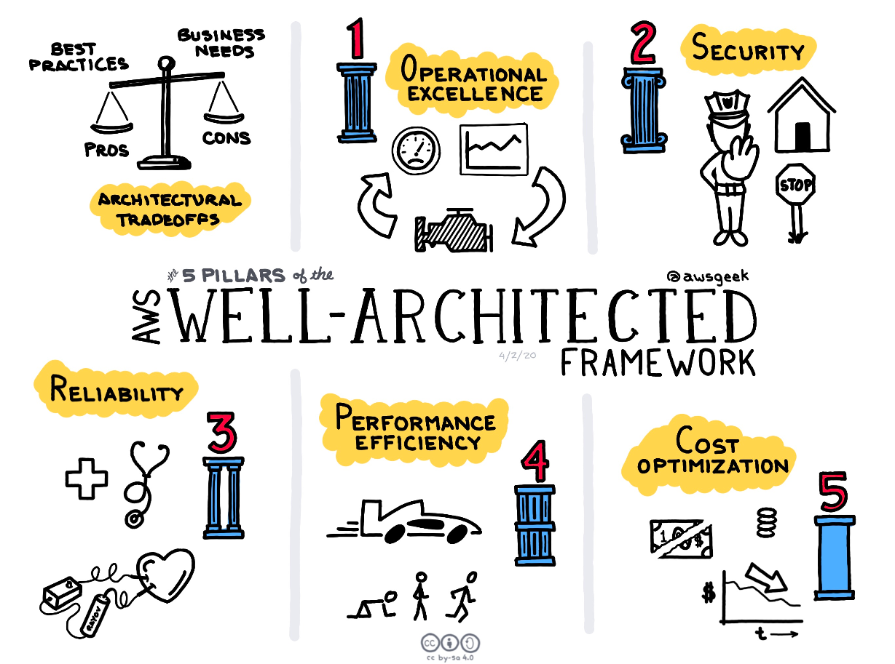
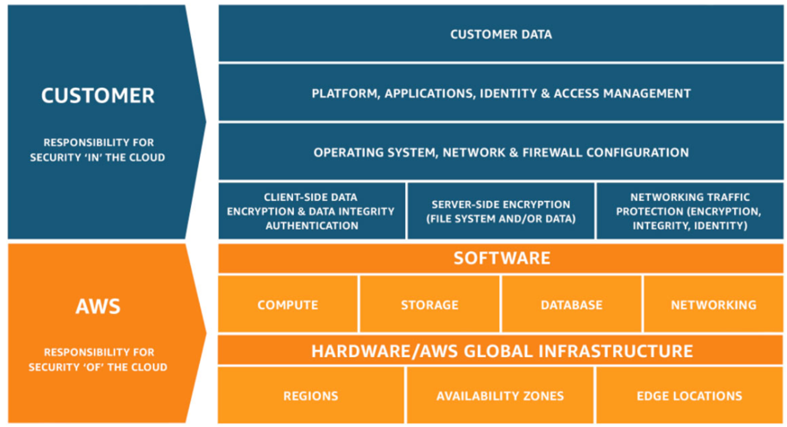

>## ! DISCLAIMER
>Despite the most of the labs in this course can be done using the AWS free tier, i.e. without any charging, there a couple of tasks that require creation of paid resources.
Resources like NAT Gateway, Route53 zone etc., will cost you some money (but not that much, fortunately). Anyway, before creating any type of resources, please be sure you carefully read and understood the appropriate pricing policy. Every type of resource is AWS has its own pricing page, for example [Route53 pricing](https://aws.amazon.com/route53/pricing/). If you cannot find the pricing policy in official AWS documentation, just google it, for example "NAT gateway pricing".
To avoid extra money expenditures, you can [set up a billing alert](https://docs.aws.amazon.com/AmazonCloudWatch/latest/monitoring/monitor_estimated_charges_with_cloudwatch.html) that will notify you immediately after you have reached some threshold in your billing.
And of course, do not forget cleaning up all the unnecessary resources after completing the lab.

# AWS Cloud Overview

   **Amazon Web Services (AWS)** is the world’s most comprehensive and broadly adopted cloud platform, offering over 200 fully featured services from data centers globally.
   AWS has the most extensive global cloud infrastructure. No other cloud provider offers as many Regions with multiple Availability Zones connected by low latency, high throughput, and highly redundant networking. AWS has 80 Availability Zones within 25 geographic regions around the world, and has announced plans for 15 more Availability Zones and 5 more AWS Regions.

   The platform is developed with a combination of infrastructure as a service (IaaS), platform as a service (PaaS) and packaged software as a service (SaaS) offerings.

## AWS Fundamentals. 
### Core Concepts
Please learn carefully the following AWS Fundamentals course: 
>Click here >> [AWS FUNDAMENTALS](https://aws.amazon.com/getting-started/fundamentals-core-concepts/)

This AWS Fundamentals Course is designed to teach you the core concepts you need to work effectively within AWS.
When first starting, AWS can seem overwhelming. A cloud-native paradigm of building infrastructure can be a radical departure from the traditional on-premises way of doing things. And regardless if this is your first time working with infrastructure or you've been tuning Linux kernels for the last decade, it can be hard to know where to start with AWS's selection of over 175 services.

The AWS Fundamentals Course is designed to help you get started with AWS regardless of your experience. In this course, we will teach you about the [five pillars](https://aws.amazon.com/architecture/well-architected/?e=gs2020&p=fundcore&p=gsrc&c=fcc) of AWS, mental models to use when thinking about the cloud, and key concepts that will be applicable across any service you end up using.
Structure
The AWS Fundamentals Course will be divided into five modules. Each module will follow the following format:

- **Intro**: A short description of the pillar we will be focusing on
- **Mental Model**: A guiding mental model to help you understand the concepts introduced in each pillar
- **Concepts**: Key concepts covering broad foundational topics for each pillar
- **Conclusion**: Summary of what we discussed
- **Further Reading**: Additional links and resources

#### The Five Pillars
The Five Pillars covered in the AWS Fundamentals Course come from the [AWS Well-Architected Framework](https://aws.amazon.com/architecture/well-architected/?e=gs2020&p=fundcore&p=gsrc&c=fcc). 
The Well-Architected Framework is the distillation of over a decade of experience building scalable applications on the cloud.
The Five Pillars consist of the following areas: ***Operational Excellence***, ***Security***, ***Reliability***, ***Performance Efficiency***, and ***Cost Optimization***.

  
---
  
### Shared Responsibility Model

Security and Compliance is a shared responsibility between AWS and the customer. 
This shared model can help relieve the customer’s operational burden as AWS operates, 
manages and controls the components from the host operating system and virtualization 
layer down to the physical security of the facilities in which the service operates. 
The customer assumes responsibility and management of the guest operating system 
(including updates and security patches), other associated application software as well 
as the configuration of the AWS provided security group firewall. 
Customers should carefully consider the services they choose as their responsibilities 
vary depending on the services used, the integration of those services into their 
IT environment, and applicable laws and regulations. The nature of this shared 
responsibility also provides the flexibility and customer control that permits 
the deployment. As shown in the chart below, this differentiation of responsibility 
is commonly referred to as Security “of” the Cloud versus Security “in” the Cloud.

**AWS responsibility “Security of the Cloud”** - AWS is responsible for protecting 
the infrastructure that runs all of the services offered in the AWS Cloud. 
This infrastructure is composed of the hardware, software, networking, and facilities 
that run AWS Cloud services.

**Customer responsibility “Security in the Cloud”** – Customer responsibility will be 
determined by the AWS Cloud services that a customer selects. This determines the amount 
of configuration work the customer must perform as part of their security responsibilities. 
For example, a service such as Amazon Elastic Compute Cloud (Amazon EC2) is categorized 
as Infrastructure as a Service (IaaS) and, as such, requires the customer to perform all 
of the necessary security configuration and management tasks. Customers that deploy an 
Amazon EC2 instance are responsible for management of the guest operating system 
(including updates and security patches), any application software or utilities installed 
by the customer on the instances, and the configuration of the AWS-provided firewall 
(called a security group) on each instance. For abstracted services, such as Amazon S3 
and Amazon DynamoDB, AWS operates the infrastructure layer, the operating system, 
and platforms, and customers access the endpoints to store and retrieve data. 
Customers are responsible for managing their data (including encryption options), 
classifying their assets, and using IAM tools to apply the appropriate permissions.

For more information please checkout the following materails: > [Shared Responsibility Model](https://aws.amazon.com/compliance/shared-responsibility-model/)

### [Video Course]: AWS Overview based on AWS Practitioner certification:
**Course Description**: This course is about basic AWS services and concepts. 
All topics in it will help to prepare and pass AWS Practitioner Certification.
  

---

**What are the services provided by AWS?**

Each type of service is categorized under a domain:
- AWS Networking and Content Delivery services
- AWS Compute services
- AWS Storage services
- Database services
- Analytics 
- Developer Tools
- Management tools
- IoT
- Security
- Enterprise app

#### **AWS Networking and Content Delivery services**

|Category|Service description|AWS service|
| :- | :- | :- |
|Network foundations|Define and provision a logically isolated network for your AWS resources|Amazon VPC|
||
Connect VPCs and on-premises networks through a central hub 

|AWS Transit Gateway|
||
Provide private connectivity between VPCs, services, and on-premises applications 

|AWS PrivateLink|
|Application networking|Automatically distribute traffic across a pool of resources, such as instances, containers, IP addresses, and Lambda functions|Elastic Load Balancing|
||Provide application-level networking for containers and microservices|AWS App Mesh|
||Create, maintain, and secure APIs at any scale|Amazon API Gateway|
|
Edge networking

|
Securely deliver data, videos, applications, and APIs to customers globally with low latency, and high transfer speeds 

|Amazon CloudFront|
||
Route users to Internet applications with a managed DNS service 

|Amazon Route 53|
||
Direct traffic through the AWS Global network to improve global application performance 

|AWS Global Accelerator|
|Network security|
Safeguard applications running on AWS against DDoS attacks 

|AWS Shield|
||
Protect your web applications from common web exploits 

|AWS WAF|
||
Centrally configure and manage firewall rules 

|AWS Firewall Manager|

#### **AWS Compute services**

|Category|Service description|AWS service|
| :- | :- | :- |
|
Instances (Virtual machines) 

|Secure and resizable compute capacity (virtual servers) in the cloud|Amazon Elastic Compute Cloud (EC2)|
||Run fault-tolerant workload for up to 90% off|Amazon EC2 Spot Instances|
||Automatically add or remove compute capacity to meet changes in demand|Amazon EC2 Autoscaling|
||Easy-to-use cloud platform that offers you everything you need to build an application or website|Amazon Lightsail|
|Containers|Highly secure, reliable, and scalable way to run containers|Amazon Elastic Container Service (ECS)|
||Easily store, manage, and deploy container images|Amazon Elastic Container Registry (ECR)|
||Fully managed Kubernetes service|Amazon Elastic Kubernetes Service (EKS)|
||Serverless compute for containers|AWS Fargate|
|Serverless|Run code without thinking about servers. Pay only for the compute time you consume|AWS Lambda|

#### **AWS Storage services**

|Category|Service description|AWS service|
| :- | :- | :- |
|
Object storage

|
Object storage built to store and retrieve any amount of data from anywhere

|
Amazon S3
|
|
File storage

|
Simple, serverless, set-and-forget, elastic file system

|
Amazon Elastic File System
|
||
Fully managed file storage built on Windows Server

|
Amazon FSx for Windows File Server

|
||Amazon FSx for Lustre is a fully managed service that provides cost-effective, high-performance, scalable storage for compute workload|
Amazon FSx for Lustre
|
|
Block storage
|Amazon Elastic Block Store (EBS) is an easy to use, high-performance, block-storage service|
Amazon Elastic Block Store
|

#### **Database services**

|Category|Service description|AWS service|
| :- | :- | :- |
|Relational|Traditional applications, ERP, CRM, e-commerce|Amazon Aurora, Amazon RDS, Amazon Redshift|
|Key-value|High-traffic web apps, e-commerce systems, gaming applications|Amazon DynamoDB|
|In-memory|Caching, session management, gaming leaderboards, geospatial applications|Amazon ElastiCache for Memcached, Amazon ElastiCache for Redis|

#### **AWS Security, Identity, & Compliance services**

|Category|Service description|AWS service|
| :- | :- | :- |
|
Identity & access management
|
Securely manage access to services and resources
|AWS Identity & Access Management (IAM)|
||Managed Microsoft Active Directory|AWS Directory Service|
||Identity management for your apps|Amazon Cognito|
|Detection|Managed threat detection service|Amazon GuardDuty|
||Analyze application security|Amazon Inspector|
||Record and evaluate configurations of your AWS resources|AWS Config|
||Track user activity and API usage|AWS CloudTrail|
|Data protection|Key storage and management|AWS Key Management Service (KMS)|
||Hardware based key storage for regulatory compliance|AWS CloudHSM|
||Provision, manage, and deploy public and private SSL/TLS certificates|AWS Certificate Manager|
||Rotate, manage and retrieve secrets|AWS Secrets Manager|

