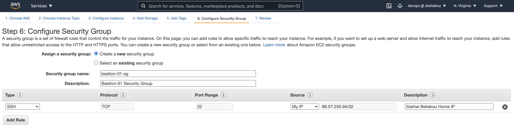
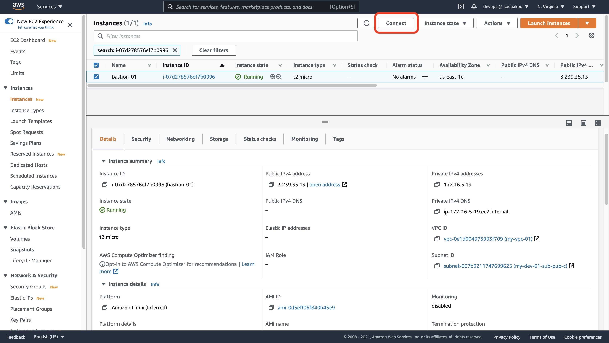

# Running EC2 Instances

- Create Bastion Host
- Create a host in private subnet
- Configure ssh access to instances
## Go to EC2 Dashboard and Launch Instance in your VPC Region


### Create Bastion Instance 

#### Choose AMI

Requirements:
- Amazon Linux 2 AMI (HVM), SSD Volume Type 
- Architecture: `64-bit (x86)`

#### Choose Instance Type

Requirements:
- Instance Type: `t2.micro`

#### Configure Instance Details

Requirements:
- Number of instances: `1`
- Network: `my-vps-01`
- Subnet: `my-dev-01-sub-pub-c`
- Auto-assign Public IP: use default settings
- Shutdown behavior: `Terminate`
- User-data (script to run on instance boot): 
    ```
    #!/bin/bash
    yum install -y tree
    ```

#### Add Storage

Requirements:
- Volume Type `Root`, Size (GiB): `20GB`, General Purpose SSD (gp2)
- Volume Type `EBS`, Size (GiB): `40GB`, General Purpose SSD (gp2)


#### Add Tags

Tags:
- Name: `bastion-01`
- Stack: `dev`
- Owner: `{Your Name}`


#### Configure Security Groups

Requirements:
- Security group name: `bastion-01-sg`
- Description: `Bastion-01 Security Group`
- SSH, Source `My IP`, Description `{Your Name} Home IP`



#### Review

#### Create SSH Key (One-time operation)


**!!! Download generated key**

#### Launch Instance

#### Review:


### Connect to Bastion Instance




## Create an Instance in Private Subnet

Requirements:

- AMI: `Amazon Linux 2 AMI (HVM), SSD Volume Type`
- Type: `t2.micro`
- Network: `my-vpc-01`
- Subnet: `my-dev-01-priv-b`
- Shutdown behavior: `Terminate`
- Name tag: `private-host`

### Connect to the host in Private Network:

Create ssh config file (`~/.ssh/config`):
```
Host bastion
  User ec2-user
  HostName {public_ip}
  IdentityFile {ssh_key_file}
  ForwardAgent yes

Host private
  User ec2-user
  HostName {private_ip}
  ForwardAgent yes
  ProxyCommand ssh -W %h:%p bastion
  IdentityFile {ssh_key_file}
```


