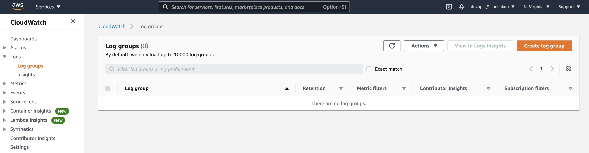

# VPC Flow Logs

## Problem to Be Solved
In this task we’re going to configure VPC Flow logs to publish flow log data directly to Amazon CloudWatch

## Explanation of the Solution
When publishing to CloudWatch Logs, flow log data is published to a log group, and each network interface has a unique log stream in the log group. 

Log streams contain flow log records:

- Flow Logs can be created for VPC, Network Interfaces or Subnets.
- If the Flow Logs are configured for a VPC , All the subnets and the network interfaces within that VPC will be monitored.
- If the Flow Logs are enabled on the subnet level , Then the network interfaces within that subnet will be monitored.
- The Flow Logs data which are collected from network interfaces, subnets or VPC is referred to as Flow Log records

## Implementation Details

### Configure Permissions

1. Create IAM Policy
2. Create IAM Role

Before creating Flow Logs, we need to grant permission for the Flow Logs to publish logs to Cloudwatch Log group.

#### Creating IAM Policy

First of all, create an IAM Role for the Flow Logs to send data to Cloudwatch Log group.
The minimum permission required for the Flow Logs are `CreateLogGroup`, `DescribeLogGroups`, `CreateLogStream`, `DescribeLogStreams`, `PutLogEvents`.

#### Creating IAM Role

Once the policy is created, we need to create an IAM role and attach the policy with it.
The role will be used later for creating Flow Logs.

To Create an IAM Role, choose **Roles** and click **Create Role**, then choose **EC2** as a Service to create a Role.

Also, we should make sure that the role has a trusted relationship that allows Flow Logs service to assume the role.
For that, Choose the Role that we have created, Select Trust Relationships and click Edit trust relationship:

Change `ec2.amazonaws.com` to `vpc-flow-logs.amazonaws.com`:

### Creating a Log Group in CloudWatch Logs

### Creating Flow Log for a VPC

To create Flow Log for a VPC , Login to VPC Console. 
- In the navigation pane ,Choose Your VPCs
- Select the VPC for which you want to create vpc Flow Log
- Under Actions , Click Create Flow Log 
- Under Flow Log setting , Provide a name for the Flow Log
- For Filter , It will ask for the type of traffic that needs to be recorded.
- Choose All to log rejected and accepted traffics.
- For Maximum aggregation interval , Choose the maximum period of time during which a Flow Logs are captured and aggregated into one Flow Logs record.

### That's it!

Now you can see VPC logs in CloudWatch:

## Tearing down

- Disable VPC Flow Log for VPC
- Delete Cloudwatch Log Group

## Pricing

Data ingestion and archival charges for vended logs apply when you publish flow logs to CloudWatch Logs or to Amazon S3. For more information and examples, see [Amazon CloudWatch Pricing](https://aws.amazon.com/cloudwatch/pricing)
