# Creating VPC

## 2.1 Creating New VPC

2.1.1 Go to VPC AWS Service

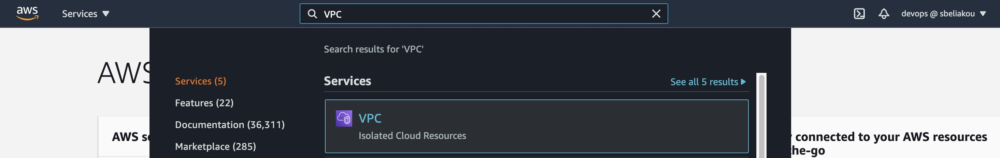

2.1.2 Choose a Region

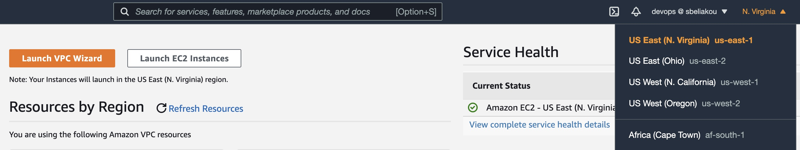

2.1.3 Choose `VPCs` Resource

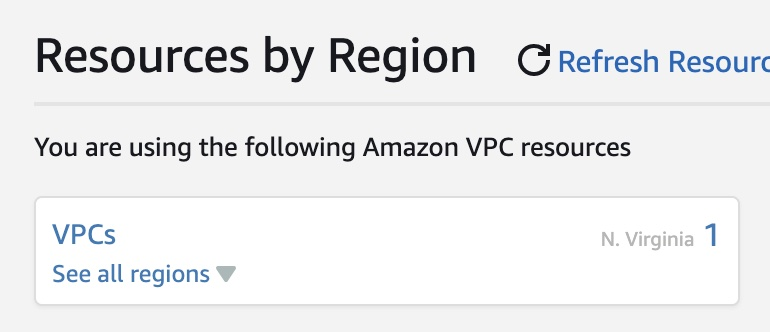

2.1.4 Create VPC

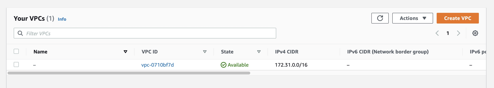

Requirements:
- Name tag: `my-vpc-01`
- IPv4 CIDR block: `172.16.0.0/16`
- Tags:
    - `stack`: `dev-01`
    - `owner`: `{Your Name}`

2.1.5 Check yourself:

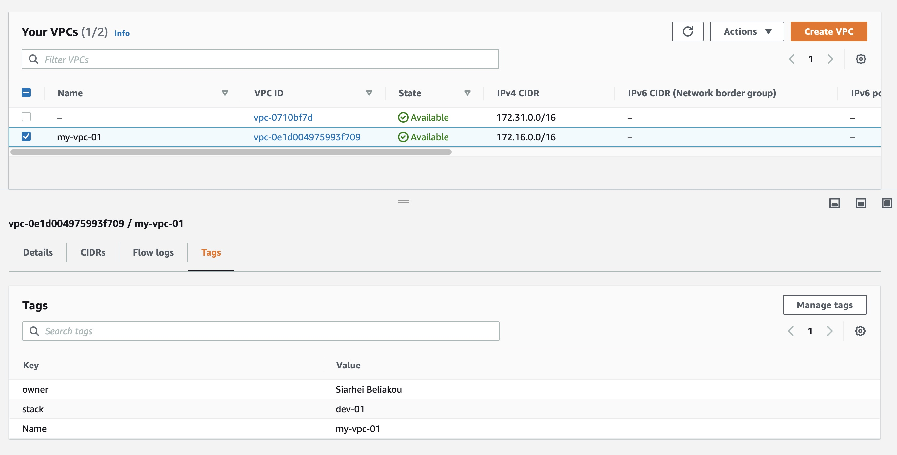

## 2.2 Create Subnets

2.2.1 Choose Subnets

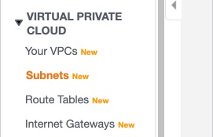

2.2.2 Create Subnets

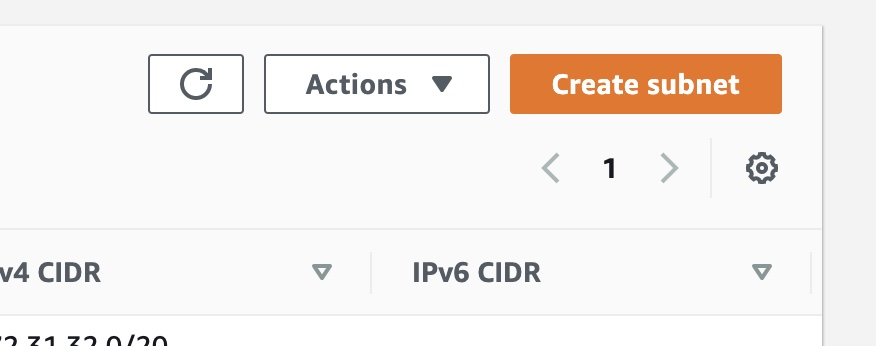

Requirements:
- VPC ID: `my-vpc-01`

Subnets:

|   |  Availability Zone-A |  Availability Zone-B | Availability Zone-C |
| --- | :---: | :---: | :---: |
| Public | `172.16.1.0/24` / `my-dev-01-sub-pub-a`  |  `172.16.3.0/24` / `my-dev-01-sub-pub-b` | `172.16.5.0/24` / `my-dev-01-sub-pub-c` |
| Private | `172.16.2.0/24` / `my-dev-01-sub-priv-a` | `172.16.4.0/24` / `my-dev-01-sub-priv-b` |  `172.16.6.0/24` / `my-dev-01-sub-priv-c` |

2.2.3 Modify Public VPC Settings to Allocate Public IP addresses automatically

For all public subnets (`my-dev-01-sub-pub-a`, `my-dev-01-sub-pub-b`, `my-dev-01-sub-pub-c`) configure "Enable auto-assign public IPv4 address":

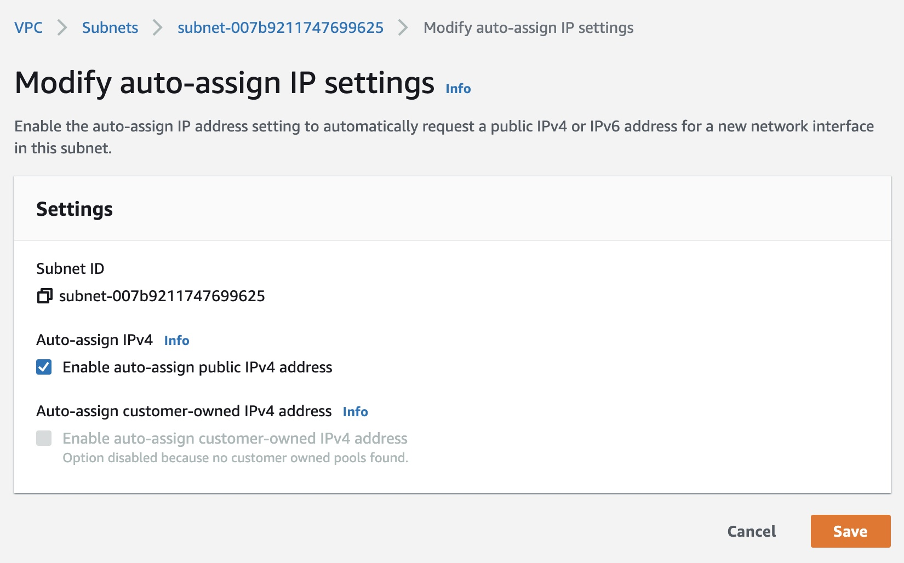

2.2.2 Check yourself:

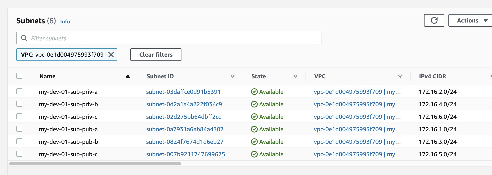

## 2.3 Creating Internet Gateway

2.3.1 Choose Internet Gateway Section

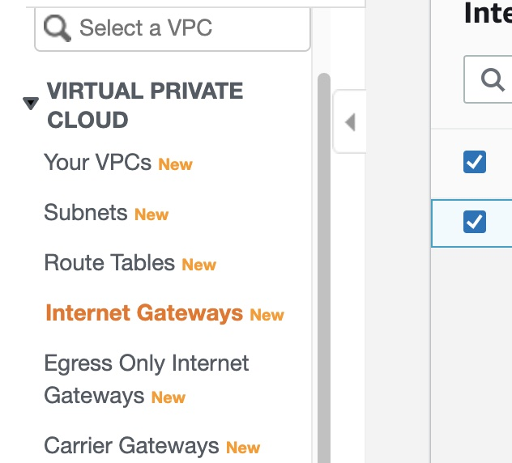

2.3.2 Create Internet Gateway

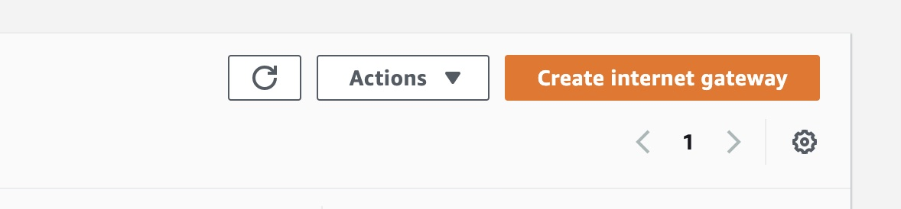

Requirements:
- Name tag: `my-vpc-01-igw`

2.3.3 Attach Internet Gateway to VPC

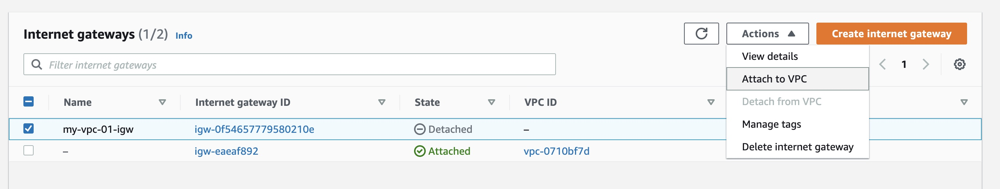

Requirements:
- Choose `my-vpc-01`

2.3.4 Verify 

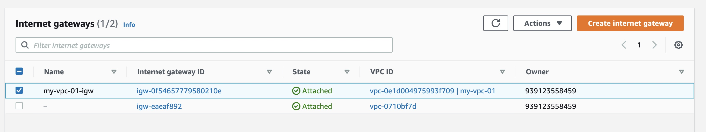

## 2.4 Configure Route Table (for public subnets)

2.4.1 Go to Route Table

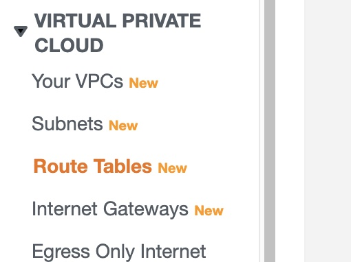

2.4.2 Choose Route Table created for your VPC

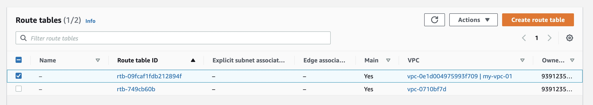

2.4.3 Edite Routes

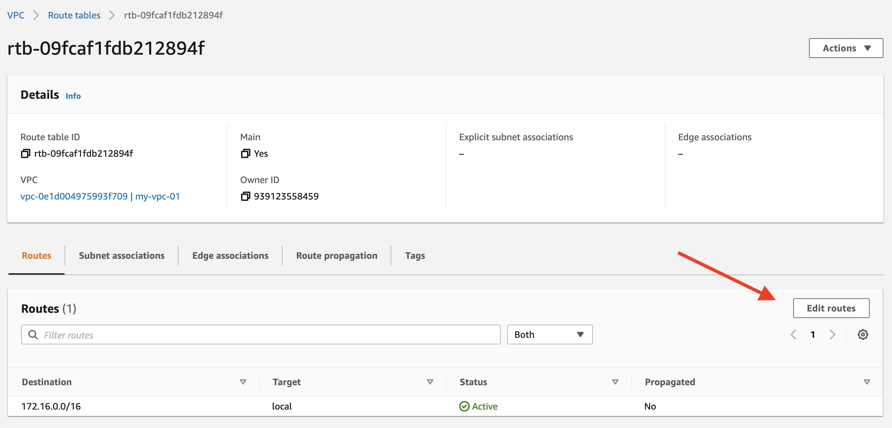
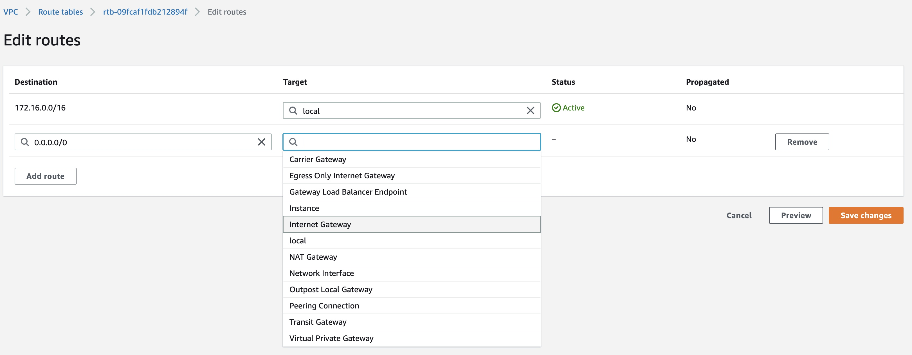

Add new Route:
- Destination: `0.0.0.0/0`
- Target: (Internet Gateway) `my-vpc-01-igw`

2.4.4 Verify:

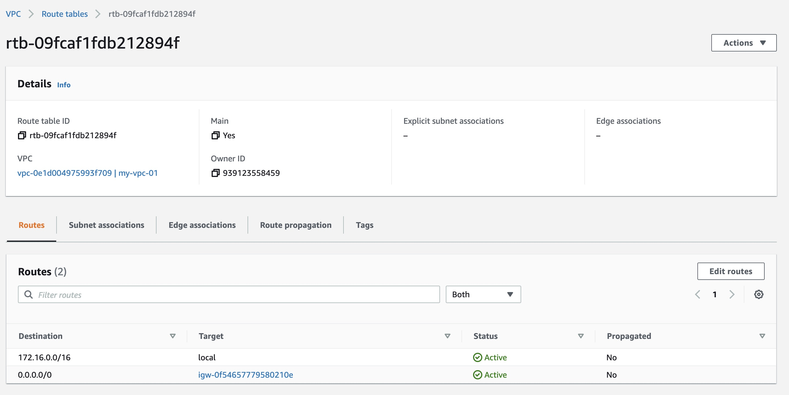

## 2.5 Create NAT Gateways / NAT Instances

2.5.1 Choose Nat Gateways

Nat Gateways is not free and should be deleted after finishing the practice

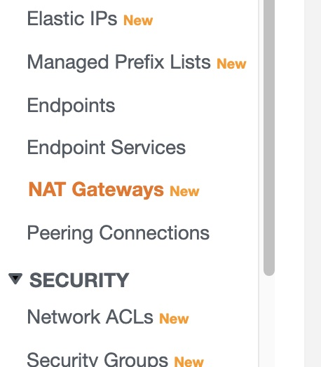

2.5.2 Create NAT gateway

Nat Gateway 1: 
- Name: `my-dev-01-natgw-a`
- Subnet: `my-dev-01-sub-pub-a`
- Connectivity type: `Public`

Nat Gateway 2: 
- Name: `my-dev-01-natgw-b`
- Subnet: `my-dev-01-sub-pub-b`
- Connectivity type: `Public`

Nat Gateway 3: 
- Name: `my-dev-01-natgw-c`
- Subnet: `my-dev-01-sub-pub-c`
- Connectivity type: `Public`

In each case click on button `Allocate Elastic IP` to get new Elastic IP for each Nat Gateway.

2.5.2 Verify:

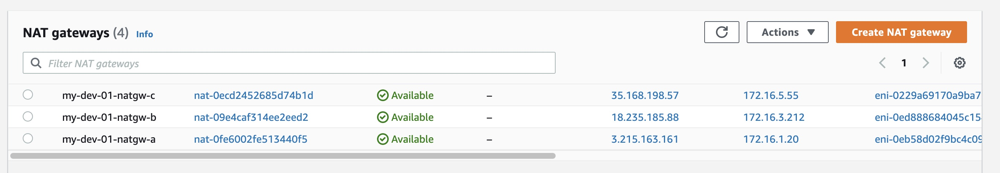

# 2.6 Create Route Tables for Private Subnets

For `my-dev-01-sub-priv-a` subnet:
- Name: `my-dev-01-rt-a`
- VPC: `my-dev-01`
- Route:
    - Destination: `0.0.0.0/0`
    - Target: (NAT Gateway) `my-dev-01-natgw-a`

For `my-dev-01-sub-priv-b` subnet:
- Name: `my-dev-01-rt-b`
- VPC: `my-dev-01`
- Route:
    - Destination: `0.0.0.0/0`
    - Target: (NAT Gateway) `my-dev-01-natgw-b`

For `my-dev-01-sub-priv-c` subnet:
- Name: `my-dev-01-rt-c`
- VPC: `my-dev-01`
- Route:
    - Destination: `0.0.0.0/0`
    - Target: (NAT Gateway) `my-dev-01-natgw-c`

2.6.1 Verify:

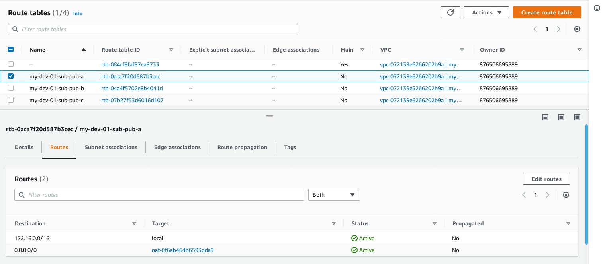

2.7 Attach routing tables to appropriate subnets.
