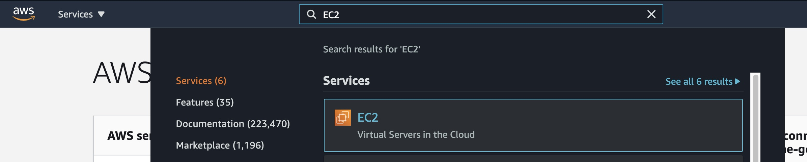
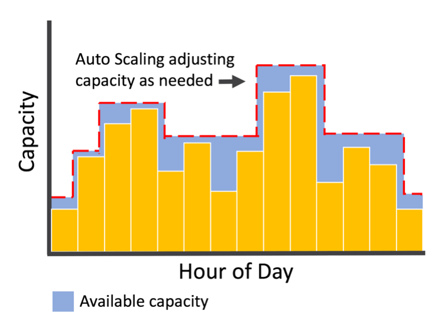
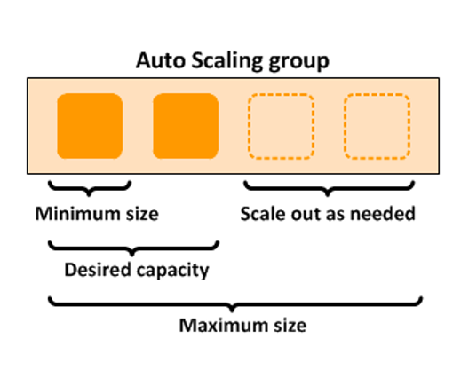
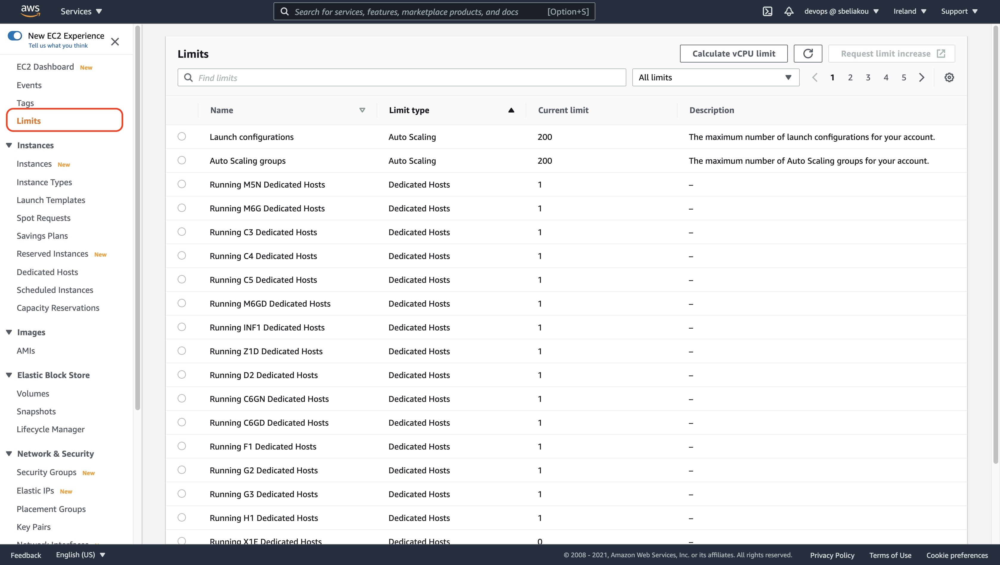
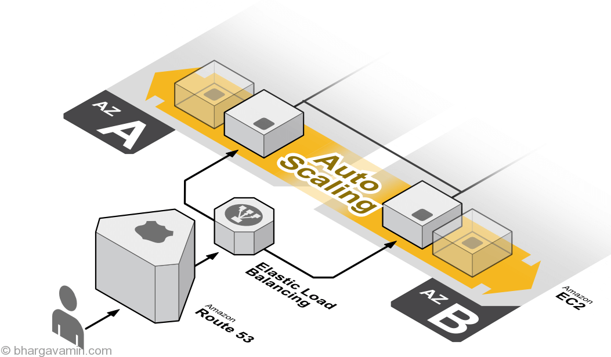

# AWS Compute Services

## Table of Content:

- [Elastic Compute Cloud - EC2](#ec2)
- [EC2 Auto Scaling](#ec2-auto-scaling)
- [Load Balancing](#load-balancing)

## Recommended Trainings:

- [AWS Certified Solutions Architect - Associate (SAA-C02): 4 Compute Services](https://learn.epam.com/detailsPage?id=946db7fc-611d-4071-bd3c-818f1a58cf99&source=EXTERNAL_COURSE)
- [AWS Certified Solutions Architect - Associate (SAA-C02): 6 Auto Scaling and Virtual Network Services](https://learn.epam.com/detailsPage?id=93b5715a-7725-4456-8034-a897287b5787&source=EXTERNAL_COURSE)
- [AWS for Developers: ECS and Multi-Region Load Balancing](https://learn.epam.com/detailsPage?id=5ec54920-682b-42e5-9331-d6be99711d40&source=EXTERNAL_COURSE)

##  Elastic Compute Cloud - EC2

### Service Overview:

**Amazon Elastic Compute Cloud (Amazon EC2)** provides scalable computing capacity in the Amazon Web Services (AWS) Cloud. Using Amazon EC2 eliminates your need to invest in hardware up front, so you can develop and deploy applications faster. You can use Amazon EC2 to launch as many or as few **virtual servers** as you need, configure security and networking, and manage storage. Amazon EC2 enables you to scale up or down to handle changes in requirements or spikes in popularity, reducing your need to forecast traffic.

### Key Information about EC2 Service:

Amazon EC2 provides the following features:
- Virtual computing environments, known as instances
- Preconfigured templates for your instances, known as Amazon Machine Images (AMIs), that package the bits you need for your server (including the operating system and additional software)
- Various configurations of CPU, memory, storage, and networking capacity for your instances, known as instance types
- Secure login information for your instances using key pairs(AWS stores the public key, and you store the private key in a secure place) 
- Storage volumes for temporary data that's deleted when you stop, hibernate, or terminate your instance, known as instance store volumes
- Persistent storage volumes for your data using Amazon Elastic Block Store (Amazon EBS), known as Amazon EBS volumes
- Multiple physical locations for your resources, such as instances and Amazon EBS volumes, known as Regions and Availability Zones
- A firewall that enables you to specify the protocols, ports, and source IP ranges that can reach your instances using security groups
- Static IPv4 addresses for dynamic cloud computing, known as **Elastic IP addresses**
- Metadata (including tags), that you can create and assign to your Amazon EC2 resources 
- Virtual networks you can create that are logically isolated from the rest of the AWS Cloud, and that you can optionally connect to your own network, known as virtual private clouds(VPCs) 

### EC2 News:
- https://aws.amazon.com/ec2/?ec2-whats-new.sort-by=item.additionalFields.postDateTime&ec2-whats-new.sort-order=desc

### Cautions

Amazon EC2 provides different resources that you can use. These resources include images, instances, volumes, and snapshots. When you create your AWS account, it configured with default quotas (also referred to as limits) on these resources on a per-Region basis. 

One of the most important is the limit on the number of running On-Demand Instances per AWS account per Region. On-Demand Instance limits are managed in terms of the number of virtual central processing units (vCPUs, regardless of the instance type). 

Please refer to the documentation:

EC2 usage are billed on one second increments, with a minimum of 60 seconds. Similarly, provisioned storage for EBS volumes will be billed per-second increments, with a 60 second minimum. Per-second billing is available for instances launched in:
- On-Demand, Reserved and Spot forms
- All regions and Availability Zones
- Amazon Linux and Ubuntu 

For details on related costs like data transfer, Elastic IP addresses, and EBS Optimized Instances, visit https://aws.amazon.com/ec2/pricing/

### EC2 Monitoring:

Monitoring is an important part of maintaining the reliability, availability, and performance of your Amazon Elastic Compute Cloud (Amazon EC2) instances and your AWS solutions. You can monitor your instances using **Amazon CloudWatch**, which collects and processes raw data from Amazon EC2 into readable, near real-time metrics. These statistics are recorded for a period of 15 months, so that you can access historical information and gain a better perspective on how your web application or service is performing. 

You could collect following EC2 metrics: 

- CPUUtilization 
- DiskReadOps 
- DiskWriteOps 
- DiskReadBytes 
- DiskWriteBytes 
- NetworkIn 
- NetworkOut 
- NetworkPacketsIn 
- NetworkPacketsOut 
- MetadataNoToken 

#### More details:

- https://docs.aws.amazon.com/AWSEC2/latest/UserGuide/viewing_metrics_with_cloudwatch.html#ec2-cloudwatch-metrics 
- [EC2 Monitoring Overview (Video)](https://www.youtube.com/watch?v=Z0agxlUrwxI)
- [EC2 Monitoring using CloudWatch Agent (Video)](https://www.youtube.com/watch?v=vAnIhIwE5hY)
- [EC2 Monitoring](https://docs.aws.amazon.com/AWSEC2/latest/UserGuide/monitoring_ec2.html)
- [Monitoring Best Practices](https://docs.aws.amazon.com/AWSEC2/latest/UserGuide/monitoring_best_practices.html)

You can use the following dimensions to refine the metrics listed in the previous list: 

https://docs.aws.amazon.com/AWSEC2/latest/UserGuide/viewing_metrics_with_cloudwatch.html#ec2-cloudwatch-dimensions 

## EC2 Auto Scaling

### Service description:  

Amazon EC2 Auto Scaling helps you ensure that you have the correct number of Amazon EC2 instances available to handle the load for your application. You create collections of EC2 instances, called Auto Scaling groups. You can specify the minimum number of instances in each Auto Scaling group, and Amazon EC2 Auto Scaling ensures that your group never goes below this size. You can specify the maximum number of instances in each Auto Scaling group, and Amazon EC2 Auto Scaling ensures that your group never goes above this size. If you specify the desired capacity, either when you create the group or at any time thereafter, Amazon EC2 Auto Scaling ensures that your group has this many instances. If you specify scaling policies, then Amazon EC2 Auto Scaling can launch or terminate instances as demand on your application increases or decreases. 

For example, the following Auto Scaling group has a minimum size of one instance, a desired capacity of two instances, and a maximum size of four instances. The scaling policies that you define adjust the number of instances, within your minimum and maximum number of instances, based on the criteria that you specify. 

### Use cases: 

You should use EC2 Auto Scaling if you only need to scale Amazon EC2 Auto Scaling groups, or if you are only interested in maintaining the health of your EC2 fleet. You should also use EC2 Auto Scaling if you need to create or configure Amazon EC2 Auto Scaling groups, or if you need to set up scheduled or step scaling policies (as AWS Auto Scaling supports only target tracking scaling policies). 

Adding Amazon EC2 Auto Scaling to your application architecture is one way to maximize the benefits of the AWS Cloud. When you use Amazon EC2 Auto Scaling, your applications gain the following benefits:

- Better fault tolerance. Amazon EC2 Auto Scaling can detect when an instance is unhealthy, terminate it, and launch an instance to replace it. You can also configure Amazon EC2 Auto Scaling to use multiple Availability Zones. If one Availability Zone becomes unavailable, Amazon EC2 Auto Scaling can launch instances in another one to compensate.
- Better availability. Amazon EC2 Auto Scaling helps ensure that your application always has the right amount of capacity to handle the current traffic demand.
- Better cost management. Amazon EC2 Auto Scaling can dynamically increase and decrease capacity as needed. Because you pay for the EC2 instances you use, you save money by launching instances when they are needed and terminating them when they aren't.

### Limits: 

Your AWS account has the default quotas, for Amazon EC2 Auto Scaling Groups, Scaling policy quotas and API-specific limits

To view the current quotas for your account, open the Amazon EC2 console at https://console.aws.amazon.com/ec2/ and navigate to the Limits page. You can also use the describe-account-limits command. To request an increase, use the Auto Scaling Limits form.

### How to setup EC2 Auto Scaling:

- https://www.youtube.com/watch?v=aVE0w40obKM

## Load Balancing

### Service Description:

A load balancer serves as the single point of contact for clients. The load balancer distributes incoming application traffic across multiple targets, such as EC2 instances, in multiple Availability Zones. This increases the availability and fault tolerance of your application. Elastic Load Balancing detects unhealthy instances and routes traffic only to healthy targets.

There are 4 types of Load Balancers available to choose: 

- An **Application Load Balancer (ALB)** functions at the application layer, the seventh layer of the Open Systems Interconnection (OSI) model. After the load balancer receives a request, it evaluates the listener rules in priority order to determine which rule to apply, and then selects a target from the target group for the rule action. You can configure listener rules to route requests to different target groups based on the content of the application traffic. Routing is performed independently for each target group, even when a target is registered with multiple target groups. You can configure the routing algorithm used at the target group level. The default routing algorithm is round robin; alternatively, you can specify the least outstanding requests routing algorithm.  

  Detailed ALB components:

    - [LoadBalancer](https://docs.aws.amazon.com/elasticloadbalancing/latest/application/application-load-balancers.html)
    - [Listeners](https://docs.aws.amazon.com/elasticloadbalancing/latest/application/load-balancer-listeners.html)
    - [Target groups](https://docs.aws.amazon.com/elasticloadbalancing/latest/application/load-balancer-target-groups.html)

 

- A **Network Load Balancer (NLB)** functions at the fourth layer of the Open Systems Interconnection (OSI) model. It can handle millions of requests per second. After the load balancer receives a connection request, it selects a target from the target group for the default rule. It attempts to open a TCP connection to the selected target on the port specified in the listener configuration.  
For TCP traffic, the load balancer selects a target using a flow hash algorithm based on the protocol, source IP address, source port, destination IP address, destination port, and TCP sequence number. The TCP connections from a client have different source ports and sequence numbers, and can be routed to different targets. Each individual TCP connection is routed to a single target for the life of the connection.  
For UDP traffic, the load balancer selects a target using a flow hash algorithm based on the protocol, source IP address, source port, destination IP address, and destination port. A UDP flow has the same source and destination, so it is consistently routed to a single target throughout its lifetime. Different UDP flows have different source IP addresses and ports, so they can be routed to different targets.

  Detailed NLB components:
    - [LoadBalancer](https://docs.aws.amazon.com/elasticloadbalancing/latest/network/network-load-balancers.html)
    - [Listeners](https://docs.aws.amazon.com/elasticloadbalancing/latest/network/load-balancer-listeners.html)
    - [Target groups](https://docs.aws.amazon.com/elasticloadbalancing/latest/network/load-balancer-target-groups.html)

 

- A **Classic Load Balancer** is a previous generation of loadbalancers. It’s recommended to consider mentioned above types of loadbalancers instead. CLB operates on Layer 4/7 of the Open Systems Interconnection (OSI) model. The only one type of LB which is compatible with EC2-Classic

- **Gateway Load Balancers** enable you to deploy, scale, and manage virtual appliances, such as firewalls, intrusion detection and prevention systems, and deep packet inspection systems. It combines a transparent network gateway (that is, a single entry and exit point for all traffic) and distributes traffic while scaling your virtual appliances with the demand.
A Gateway Load Balancer operates at the third layer of the Open Systems Interconnection (OSI) model, the network layer. It listens for all IP packets across all ports and forwards traffic to the target group that's specified in the listener rule. It maintains stickiness of flows to a specific target appliance using 5-tuple (for TCP/UDP flows) or 3-tuple (for non-TCP/UDP flows).  
Gateway Load Balancers use Gateway Load Balancer endpoints to securely exchange traffic across VPC boundaries. Traffic to and from a Gateway Load Balancer endpoint is configured using route tables. Traffic flows from the service consumer VPC over the Gateway Load Balancer endpoint to the Gateway Load Balancer in the service provider VPC, and then returns to the service consumer VPC. You must create the Gateway Load Balancer endpoint and the application servers in different subnets. This enables you to configure the Gateway Load Balancer endpoint as the next hop in the route table for the application subnet.
AWS Demo: [Getting Started with AWS Gateway Load Balancer](https://youtu.be/f4DduW2M5WI)

### Use cases / Considerations
Comparison of different Loadbalancers is gathered in [the provided table](https://aws.amazon.com/elasticloadbalancing/features/#Product_comparisons).
In case of CLB don’t forget to activate [cross-zone loadbalancing](https://docs.aws.amazon.com/elasticloadbalancing/latest/classic/enable-disable-crosszone-lb.html).
ELBs can be Internet facing or internal-only.

#### ReIvent videos to make a right decision on LoadBalancer type:
- [AWS re:Invent 2019: Get the most from Elastic Load Balancing for different workloads (NET407-R2)](https://youtu.be/HKh54BkaOK0)
- [AWS re:Invent 2020: Choosing the right load balancer for serverless applications](https://youtu.be/mjabA8aQjks)

### Governance

There are different metrics available for each type of loadbalancer:
- [ALB metrics](https://docs.aws.amazon.com/elasticloadbalancing/latest/application/load-balancer-cloudwatch-metrics.html)
- [CLB metrics](https://docs.aws.amazon.com/elasticloadbalancing/latest/classic/elb-cloudwatch-metrics.html)
- [NLB metrics](https://docs.aws.amazon.com/elasticloadbalancing/latest/network/load-balancer-cloudwatch-metrics.html)
- [GLB metrics](https://docs.aws.amazon.com/elasticloadbalancing/latest/gateway/cloudwatch-metrics.html)

It's highly recommended paying attention to such metric as **Request/Error counts**, **Latency**, **Healthy/Unhealty hosts counts**. For CLB **SurgeQueueLength** and **SpilloverCount**.
Also It worth activating Access Log collection to S3 bucket.

### Cautions

- Please be acquainted with existing quotas per each type of LB - [Application](https://docs.aws.amazon.com/elasticloadbalancing/latest/application/load-balancer-limits.html), [Classic](https://docs.aws.amazon.com/elasticloadbalancing/latest/classic/elb-limits.html), [Network](https://docs.aws.amazon.com/elasticloadbalancing/latest/network/load-balancer-limits.html) and [Gateway](https://docs.aws.amazon.com/elasticloadbalancing/latest/gateway/quotas-limits.html)
- ALB does not support a static IP address but does have a fixed DNS address - you can put an NLB in front of an ALB to get a static IP address
- ALB requires prewarming if you’re experiencing spike in traffic – just raise the ticket to support. Be aware that ALB can consume up to 100 ip addresses in subnets, where it’s placed – keep it mind during network planning phase.
- Whitelist your loadbalancers for targets via SG/NACLs

### ELB Monitoring:

You can use the following features to monitor your load balancers, analyze traffic patterns, and troubleshoot issues with your load balancers and back-end instances.  

- **CloudWatch metrics**  
  Elastic Load Balancing publishes data points to Amazon CloudWatch about your load balancers and back-end instances. 		 

- **Elastic Load Balancing access logs**  
  The access logs for Elastic Load Balancing capture detailed information for requests made to your load balancer and stores them as log files in the Amazon S3 bucket that you specify.				  

- **CloudTrail logs**  
  AWS CloudTrail enables you to keep track of the calls made to the Elastic Load Balancing API by or on behalf of your AWS account. CloudTrail stores the information in log files in the Amazon S3 bucket that you specify. 

#### More Details:

- [Monitor your Application Load Balancers](https://docs.aws.amazon.com/elasticloadbalancing/latest/application/load-balancer-monitoring.html)
- [Troubleshoot your Application Load Balancers](https://docs.aws.amazon.com/elasticloadbalancing/latest/application/load-balancer-troubleshooting.html)

### Pricing considerations
The pricing is consolidated on common [AWS page](https://aws.amazon.com/elasticloadbalancing/pricing/)

### More details
- [AWS re:Invent 2020: Elastic Load Balancing: A year of innovations](https://youtu.be/cntxaahxtfM)
