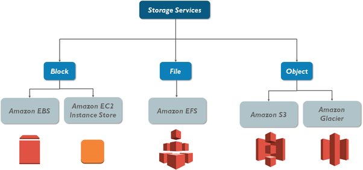
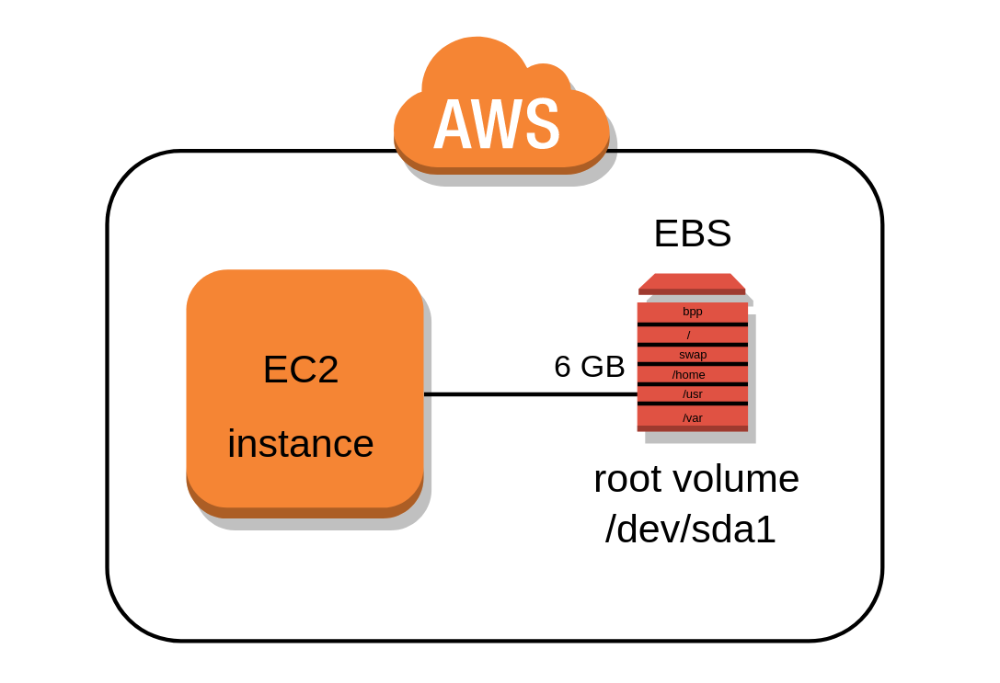
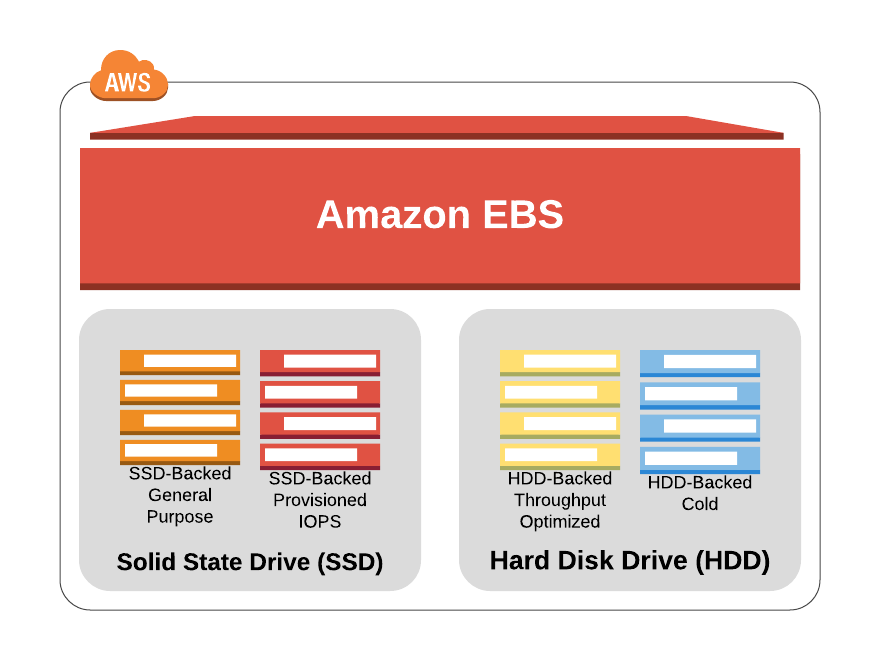
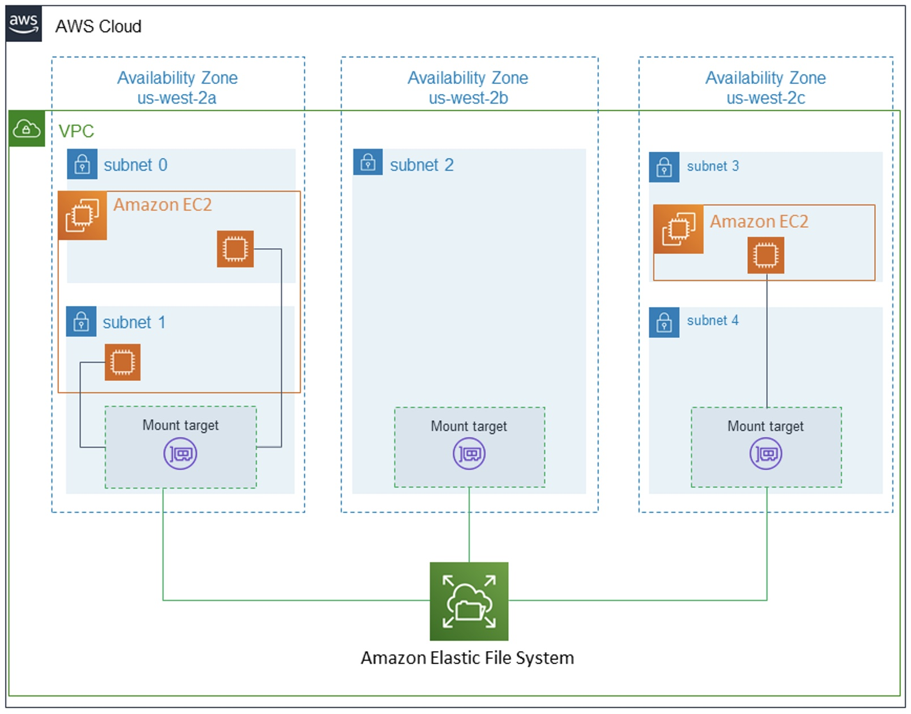
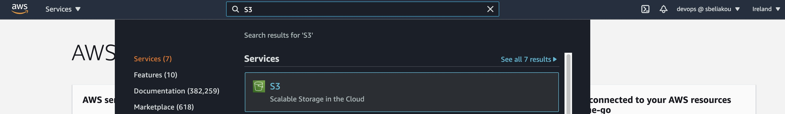

# AWS Storage Services

## Table of Content

- Elastic Block Storage (EBS)
- Elastic File System (EFS)
- FSx
- Simple Storage Service (S3)
- Storage Gateway
- AWS Backup

## Recommended Training:

- [AWS Certified Solutions Architect - Associate (SAA-C02): 2 Storage Design](https://learn.epam.com/detailsPage?id=2a69c48d-24e4-4f5d-b89c-e08d0d82ef5d&source=EXTERNAL_COURSE)

## AWS Storage Services

## Elastic Block Storage (EBS)

Amazon Elastic Block Store (EBS) is an easy to use, high-performance, block-storage service designed for use with Amazon Elastic Compute Cloud (EC2) for both throughput and transaction intensive workloads at any scale. A broad range of workloads, such as relational and non-relational databases, enterprise applications, containerized applications, big data analytics engines, file systems, and media workflows are widely deployed on Amazon EBS. 
 
You can choose from six different volume types to balance optimal price and performance. You can achieve single-digit-millisecond latency for high-performance database workloads such as SAP HANA or gigabyte per second throughput for large, sequential workloads such as Hadoop. You can change volume types, tune performance, or increase volume size without disrupting your critical applications, so you have cost-effective storage when you need it. 

Designed for mission-critical systems, EBS volumes are replicated within an Availability Zone (AZ) and can easily scale to petabytes of data. Also, you can use EBS Snapshots with automated lifecycle policies to back up your volumes in Amazon S3, while ensuring geographic protection of your data and business continuity. 

### EBS Volume Types 

Amazon EBS provides multiple volume types that allow you to optimize storage performance and cost for a broad range of applications. These volume types are divided into two major categories: SSD-backed storage for transactional workloads, such as databases, virtual desktops and boot volumes, and HDD-backed storage for throughput intensive workloads, such as MapReduce and log processing. 
 
General volume types are: 

1. SSD-based volumes: 
    - General Purpose Volumes gp2, gp3 
    - Provisioned IOPS Volume io2 
 

2. HDD-based volumes:
    - Throughput Optimized HDD volumes st1 
    - Cold HDD Volumes sc1

### Amazon [EBS Snapshots](https://docs.aws.amazon.com/AWSEC2/latest/UserGuide/EBSSnapshots.html):

- Incremental – only backup changed blocks 
- EBS backups use IO and you shouldn’t run them while your application is handling a lot of traffic 
- Snapshots will be stored in S3 (but you won't directly see them) 
- Not necessary to detach volume to do snapshots, but recommended 
- Max 100000 snapshots 
- Can copy snapshots cross AZ or Region 
- Can make Image (AMI) from snapshots 
- EBS volumes restored by snapshots need to be pre-warmed (using fio or dd command to read the entire volume) 
- Snapshots can be automated using Amazon Data Lifecycle Manager 

### EBS [Encryption](https://docs.aws.amazon.com/AWSEC2/latest/UserGuide/EBSEncryption.html):

- When you create an encrypted EBS volume, you get the following: 
    - Data at rest is encrypted inside the volume 
    - All the data in flight moving between the instance and the volume is encrypted 
    - All snapshots are encrypted 
    - All volumes created from the snapshots 

- Encryption and decryption are handled transparently (you have nothing to do) 
- Encryption has a minimal impact on latency 
- EBS encryption leverages keys from KMS (AES-256) 
- Copying an encrypted snapshot allows encryption 
- Snapshots of encrypted volumes are encrypted 

### EBS Migration:

- EBS Volumes are only locked to specific AZ 
- To migrate it to a different AZ (or region) 
    - [Snapshot the volume](https://docs.aws.amazon.com/AWSEC2/latest/UserGuide/ebs-creating-snapshot.html)
    - (optional) [Copy the volume](https://docs.aws.amazon.com/AWSEC2/latest/UserGuide/ebs-copy-snapshot.html) to a different region 
    - Create a volume from the snapshot in the AZ of your choice 

### EBS vs Instance Store 
- Some instances do not come with Root EBS volumes (which are "ephemeral")
- Instance store is physically attached to the machine (EBS is a network drive) 

  #### Pros:
  - Better I/O performance 
  - Good for buffer/cache/scratch data/temporary content 
  - Data survives reboots 

  #### Cons:
  - On stop or termination, the instance store is lost 
  - You can't resize the instance store
  - Backups must be operated by the user

### Use cases / Considerations 

General Purpose SSD volumes (gp2 and gp3) balance price and performance for a wide variety of transactional workloads. These volumes are ideal for use cases such as boot volumes, medium-size single instance databases, and development and test environments. 

Provisioned IOPS SSD volumes (io1 and io2) support up to 64,000 IOPS and 1,000 MiB/s of throughput. This enables you to predictably scale to tens of thousands of IOPS per EC2 instance. 

Throughput Optimized HDD volumes (st1) provide low-cost magnetic storage that defines performance in terms of throughput rather than IOPS. These volumes are ideal for large, sequential workloads such as Amazon EMR, ETL, data warehouses, and log processing. 

Cold HDD volumes (sc1) provide low-cost magnetic storage that defines performance in terms of throughput rather than IOPS. These volumes are ideal for large, sequential, cold-data workloads. If you require infrequent access to your data and are looking to save costs, these volumes provide inexpensive block storage. 

### Governance 

There are different metrics available for EBS volumes: 

- [Amazon EBS metrics](https://docs.aws.amazon.com/AWSEC2/latest/UserGuide/using_cloudwatch_ebs.html#ebs-metrics)
- [Dimensions for Amazon EBS metrics](https://docs.aws.amazon.com/AWSEC2/latest/UserGuide/using_cloudwatch_ebs.html#ebs-metric-dimensions)
- [Graphs in the Amazon EC2 console](https://docs.aws.amazon.com/AWSEC2/latest/UserGuide/using_cloudwatch_ebs.html#graphs-in-the-aws-management-console-2)

You can back up the data on your Amazon EBS volumes to Amazon S3 by taking point-in-time snapshots. [Snapshots](https://aws.amazon.com/ebs/snapshots/) are incremental backups, which means that only the blocks on the device that have changed after your most recent snapshot are saved. 

[Amazon Data Lifecycle Manager](https://docs.aws.amazon.com/AWSEC2/latest/UserGuide/snapshot-lifecycle.html) can be used to automate the creation, retention, and deletion of snapshots that you use to back up your Amazon EBS volumes. 

### Pricing considerations 

All info regarding EBS pricing can be found in [AWS docs](https://aws.amazon.com/ebs/pricing/)

### More details 

- https://aws.amazon.com/ebs/ 
- https://aws.amazon.com/ebs/volume-types/ 
- https://aws.amazon.com/ebs/snapshots/ 
- https://docs.aws.amazon.com/AWSEC2/latest/UserGuide/AmazonEBS.html 
- [AWS re:Invent 2019: [REPEAT 1] Deep dive on Amazon EBS](https://www.youtube.com/watch?v=wsMWANWNoqQ)
- [Amazon Elastic Block Store (EBS) Overview](https://www.youtube.com/watch?v=77qLAl-lRpo)

## Elastic File System (EFS)

**Amazon EFS** is an AWS file sharing service that lets you manage file shares, like those used on traditional networks, and mount them on cloud or on-premises machines using the **NFSv4 protocol**.

It is a scalable, cloud-based file system for Linux-based applications and workloads that can be used in combination with AWS cloud services and on-premise resources. EFS offers a choice between two storage classes:
- Standard access - is designed for frequently accessed files
- Infrequent Access (EFS-IA)- is developed for storing long-lived but less used files at a lower cost

### Some of EFS’ key features include:
- **Shared Storage**  
  Files are accessible from AWS services as well as from on-premise. They can be simultaneously accessed by up to a thousand EC2 instances within the cloud or via VPN or AWS Direct Connect, making EFS good for hybrid solutions. File access is possible across multiple AWS Availability Zones (AZs) and Regions, for easier collaboration and global remote work.

- **Scalable Performance**  
  EFS is designed for low latency with IOPS and throughput that scale with usage and the number of attached instances, meaning that as storage size grows, performance increases. At peak performance, it offers 10 GB/sec throughput and 500k IOPS. EFS scales automatically as data is moved in or out, minimizing fears of running out of space or paying for storage you aren’t using. Learn more about how file sharing impacts cloud scalability and agility.

- **Secure and Compliant**  
  EFS allows multiple layers of security and relies on your existing security infrastructure. It can be used with Amazon's Identity and Access Management (IAM) roles as well as VPC security groups and allows you to define individual file permissions using POSIX. EFS has built-in compliance with common regulatory standards, including PCI DSS, HIPAA, and SOC with the ability to meet others if necessary. Learn more about best practices for secure cloud file sharing.

### AWS EFS Backup Solutions

Since a storage solution is only really useful when it can be backed up, you should be aware of your [backup options with EFS](https://cloud.netapp.com/blog/efs-backup-methods). Keep in mind, other ways exist if you want to use third-party products integrated with AWS. Also, learn more about general considerations for backup and archiving in the cloud.Amazon Backup Service

**AWS Backup** is a fully managed service that allows you to create, manage, and automate incremental backups according to a schedule you define through a central location. This system is PCI and ISO compliant and HIPAA eligible, to ensure that your compliance needs are covered. It is possible to use AWS Backup whether your system has a cloud-native, hybrid, or on-premise configuration.This solution is easy to implement, and incremental backups help keep your costs low but requires manually pausing the applications and processes being backed up and only allows backups to be stored on EFS.EFS to EFS Backup

**There is no built-in EFS backup**, and EFS does not have a native snapshot mechanism. So, before AWS Backup was released, backups had to be done using a template in AWS CloudFormation. This involves using scripts to access the AWS Data Pipeline, from which you must transfer data between multiple services before finally storing the backed-up data in EFS. With this process, you are still able to control backup schedules and life cycles as with the AWS Backup Service.The main downsides of this option are that it does require some programming knowledge and is not easily monitored. Additionally, if you are not careful to change time constraints according to the amount of data you are backing up, your process can fail.Backing Up to Amazon S3

**Backing up your data to S3** is another option you might consider and one that can help decrease your storage costs. This process begins the same as the EFS to EFS backup but rather than moving the incremental backups from S3 to EFS at the end of the process, they are simply left in S3.Like EFS to EFS, you can schedule your backups and manage life cycle length but you must also have some programming ability and be familiar with the use of scripts for automating processes.

### Advantages to using an EFS
- An Amazon EFS is elastic. That means its storage capacity can be automatically scaled up (add more storage) or scaled down (shrink storage capacity) as folders and files are added to or removed from the system. This is a major advantage over traditional storage solutions—you can add or remove capacity without disrupting users or applications.

- Importantly, EFS storage is permanent. When attached to an AWS compute instance, data will not disappear when that instance is relaunched.

### Disadvantages to using an EFS
Amazon EFSs do have a couple limitations:

- No Windows instances. Amazon EFSs are not supported on AWS Windows EC2 instances. EFS volumes can only be used with non-Windows instances, such as Linux, that support NFS volumes.
- No system boot volumes. Amazon EFS volumes also cannot be used for system boot volumes. AWS EC2 instances must use Elastic Block Store (EBS) volumes for booting their systems. EBS volumes are like EFS volumes with one exception. An EBS volume can only be connected to one EC2 instance or server, while EFS volumes can be connected to several EC2 instances and on-premises resources.

### Use cases for EFS volumes

An EFS is suitable for the following use cases:

- Web serving and content management
- Enterprise application usage
- Media and entertainment
- Shared and home directories
- Database backups
- Developer and application tools
- Container storage
- Big data analytics
- Other applications where you need to connect a common data source to a single server or multiple servers

### Pricing considerations

With Amazon EFS, you pay only for the storage used by your file system and there is no minimum fee or setup cost. 

Amazon EFS offers a range of storage classes designed for different use cases. These include: 
- Standard storage classes – EFS Standard and EFS Standard–Infrequent Access (Standard–IA), which offer multi-AZ resilience and the highest levels of durability and availability
- One Zone storage classes – EFS One Zone and EFS One Zone–Infrequent Access (EFS One Zone–IA), which offer customers the choice of additional savings by choosing to save their data in a single AZ 

For more information, see [Managing EFS storage classes](https://docs.aws.amazon.com/efs/latest/ug/storage-classes.html).

Costs related to Provisioned Throughput are determined by the throughput values you specify. For more information, see [Amazon EFS Pricing](https://aws.amazon.com/efs/pricing)

### More details:
- Use official Amazon documentation https://docs.aws.amazon.com/efs/latest/ug/index.html
- https://cloud.netapp.com/blog/aws-efs-is-it-the-right-storage-solution-for-you
- https://www.bmc.com/blogs/aws-efs-elastic-file-system/
- https://cloud.netapp.com/blog/efs-backup-methods
- https://cloud.netapp.com/blog/efs-performance-dos-and-donts-aws-cvo-blg

## AWS FSx for Windows File Server

Amazon FSx for Windows File Server provides fully managed Microsoft Windows file servers, backed by a fully native Windows file system. Amazon FSx for Windows File Server has the features, performance, and compatibility to easily lift and shift enterprise applications to the AWS Cloud.  

Amazon FSx supports a broad set of enterprise Windows workloads with fully managed file storage built on Microsoft Windows Server. Amazon FSx has native support for Windows file system features and for the industry-standard Server Message Block (SMB) protocol to access file storage over a network. Amazon FSx is optimized for enterprise applications in the AWS Cloud, with native Windows compatibility, enterprise performance and features, and consistent sub-millisecond latencies.  

As a fully managed service, Amazon FSx for Windows File Server eliminates the administrative overhead of setting up and provisioning file servers and storage volumes. Additionally, Amazon FSx keeps Windows software up to date, detects and addresses hardware failures, and performs backups. It also provides rich integration with other AWS services like [AWS IAM](https://docs.aws.amazon.com/IAM/latest/UserGuide/introduction.html), [AWS Directory Service for Microsoft Active Directory](https://docs.aws.amazon.com/directoryservice/latest/admin-guide/directory_microsoft_ad.html), [Amazon WorkSpaces](https://docs.aws.amazon.com/workspaces/latest/adminguide/amazon-workspaces.html), [AWS Key Management Service](https://docs.aws.amazon.com/kms/latest/developerguide/overview.html), and [AWS CloudTrail](https://docs.aws.amazon.com/awscloudtrail/latest/userguide/cloudtrail-user-guide.html). 

## Amazon Simple Storage Service (Amazon S3)

**Amazon Simple Storage Service**, widely known as **Amazon S3**, is a highly scalable, fast, and durable solution for object-level storage of any data type. Unlike the operating systems we are all used to, Amazon S3 does not store files in a file system, instead it stores files as objects. Object Storage allows users to upload files, videos, and documents like you were to upload files, videos, and documents to popular cloud storage products like Dropbox and Google Drive. This makes Amazon S3 very flexible and platform agnostic.

### How Amazon S3 works

Amazon S3 works as an object storage service. This is different from your typical file storage or even block storage. When a user uploads data to S3, that file is stored as an object with metadata intact and the object as a whole is given an ID.

There are two different kinds of metadata. **System-Defined** and **User-Defined Metadata**. System metadata is used for S3 to maintain important things such as creation date, size, and last-modified.

Objects also take in user-defined metadata. User-defined metadata allows users to assign key-value pairs to the data they upload. These key-value pairs help users identify, organize, and assign objects to specific resources, or allow for easy retrieval.

### S3 SLA

Some major advantages of using Amazon S3 include durability, security, and reliability. Per Amazon’s documentation, Amazon S3 provides customers with a `99.999999999%` rate of durability.

How does Amazon achieve this level of durability? AWS S3 redundantly stores your data across multiple devices spanning at least three AZs (Availability Zones) in an S3 Region.

### Amazon S3 Concepts:

#### Buckets

A **Bucket** is the fundamental container for objects stored in Amazon S3. Drawing parallels with the traditional filesystems, Amazon S3 allows to store objects (files) in “buckets” (directories). 

Some facts about Buckets: 

- Buckets must have a globally unique name 
- Buckets are defined at the region level 

Buckets serve several purposes: 
- They organize the Amazon S3 namespace at the highest level. 
- They identify the account responsible for storage and data transfer charges. 
- They play a role in access control. 
- They serve as the unit of aggregation for usage reporting. 

For more information about buckets, see [Buckets overview](https://docs.aws.amazon.com/AmazonS3/latest/userguide/UsingBucket.html) 

To understand how to work with buckets, see [Creating, configuring, and working with Amazon S3 buckets](https://docs.aws.amazon.com/AmazonS3/latest/userguide/creating-buckets-s3.html)

#### Objects 

An **object** is uniquely identified within a bucket by a key (name) and a version ID. 

An object consists of the following:  

- Key 
- Version ID 
- Value 
- Some Metadata 
- Subresources 
- Access control information 

For more information about objects and working with it, see [Uploading, downloading, and working with objects in Amazon S3](https://docs.aws.amazon.com/AmazonS3/latest/userguide/uploading-downloading-objects.html)

#### Regions 

Buckets tied to the regions.  

You can choose the geographical AWS Region where Amazon S3 will store the buckets that you create. You might choose a Region to optimize latency, minimize costs, or address regulatory requirements. Objects stored in a Region never leave the Region unless you explicitly transfer them to another Region. For example, objects stored in the Europe (Ireland) Region never leave it.  

For more information, see [Regions and Endpoints](https://docs.aws.amazon.com/general/latest/gr/rande.html#s3_region)

### Amazon S3 features 

#### Storage Classes 

Each object in Amazon S3 has a storage class associated with it.  

For example, if you list the objects in an S3 bucket, the console shows the storage class for all the objects in the list.  

Amazon S3 offers a range of storage classes for the objects that you store. You choose a class depending on your use case scenario and performance access requirements. All of these storage classes offer high durability.  

The main S3 storage classes include (but are not limited to) the following: 

- S3 Standard for general-purpose storage of frequently accessed data; 
- S3 Standard_IA for long-lived, but less frequently accessed data; 
- S3 Glacier for long-term archive.  

For a quick comparison of Storage Classes table, see [Comparing the Amazon S3 storage classes](https://docs.aws.amazon.com/AmazonS3/latest/userguide/storage-class-intro.html#sc-compare)

For more information about Storage Classes, choosing the right storage class for you data and using it, see [Using Amazon S3 storage classes](https://docs.aws.amazon.com/AmazonS3/latest/userguide/storage-class-intro.html)

#### S3 Security 

Security is a shared responsibility between AWS and you. The [shared responsibility model](https://aws.amazon.com/compliance/shared-responsibility-model/) describes this as security of the cloud and security in the cloud. 

Security in AWS S3 is provided at different levels. S3 Bucket security can be: 

**User based:**
- IAM policies; controls which API calls should be allowed for a specific user from IAM console 

**Resource Based:**
- Bucket Policies is bucket-wide rules from the S3 console (it also allows cross account access)
- Object Access Control List (ACL) provides finer grain control
- Bucket ACL – less common

To go straight to the S3 security tips and best practices, visit the following section of the Amazon documentation: [Security Best Practices for Amazon S3](https://docs.aws.amazon.com/AmazonS3/latest/userguide/security-best-practices.html#server-side)

#### AWS Identity and Access Management  

You can use AWS Identity and Access Management (IAM) to manage access to your Amazon S3 resources. 

For example, you can use IAM with Amazon S3 to control the type of access a user or group of users has to specific parts of an Amazon S3 bucket your AWS account owns.  

For more information about IAM, see the following: 

- [AWS Identity and Access Management (IAM)](https://aws.amazon.com/iam/)
- [Getting started](https://docs.aws.amazon.com/IAM/latest/UserGuide/getting-started.html)

#### Bucket policies 

Using S3 bucket policy may help to: 

- Grant public access to the bucket 
- Force objects to be encrypted at upload 
- Grant access to another account (Cross Account) 

For more information about Bucket policies and its usage, see [Bucket policies and user policies](https://docs.aws.amazon.com/AmazonS3/latest/userguide/using-iam-policies.html)

#### Access control lists 

You can control access to each of your buckets and objects using an access control list (ACL).  

For more information, see [Access control list (ACL) overview](https://docs.aws.amazon.com/AmazonS3/latest/userguide/acl-overview.html)

### Common Use Scenarios:

The AWS Solutions site lists many of the ways you can use Amazon S3. The following list summarizes some of those ways.

- Backup and storage – Provide data backup and storage services for others.
- Application hosting – Provide services that deploy, install, and manage web applications.
- Media hosting – Build a redundant, scalable, and highly available infrastructure that hosts video, photo, or music uploads and downloads.
- Software delivery – Host your software applications that customers can download.

Some Examples:

### Governance 

Monitoring is an important part of maintaining the reliability, availability, and performance of Amazon S3 and your AWS solutions. For information about monitoring Amazon S3, see [Monitoring Amazon S3](https://docs.aws.amazon.com/AmazonS3/latest/userguide/monitoring-overview.html)

You can use analytics and insights in Amazon S3 to understand, analyze, and optimize your storage usage. For information about analytics and insights for Amazon S3, see [Using analytics and insights](https://docs.aws.amazon.com/AmazonS3/latest/userguide/analytics-insights.html)

### Pricing considerations 

For information about Amazon S3 prices, see [Amazon S3 pricing](https://aws.amazon.com/s3/pricing/?nc=sn&loc=4)

### More details 

Use official Amazon documentation https://docs.aws.amazon.com/s3/index.html 