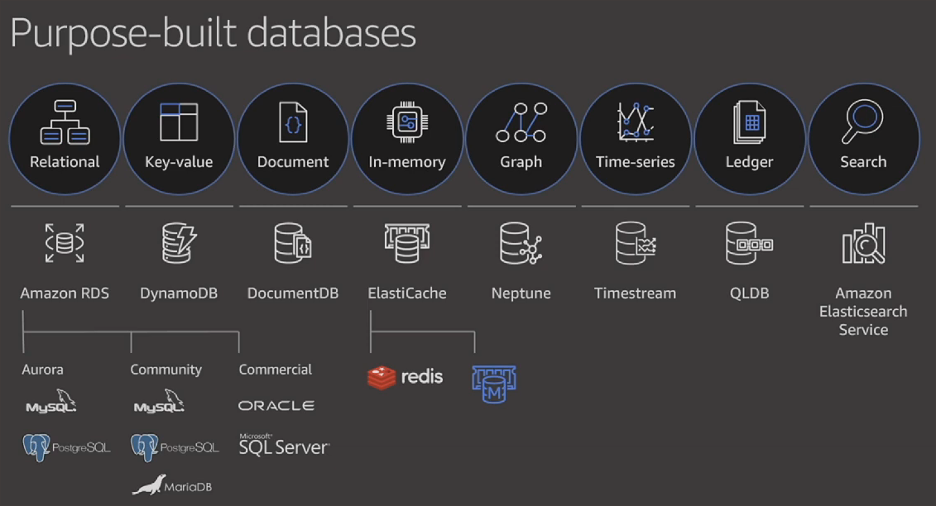
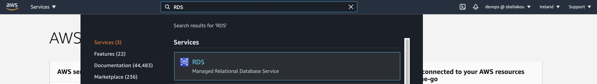
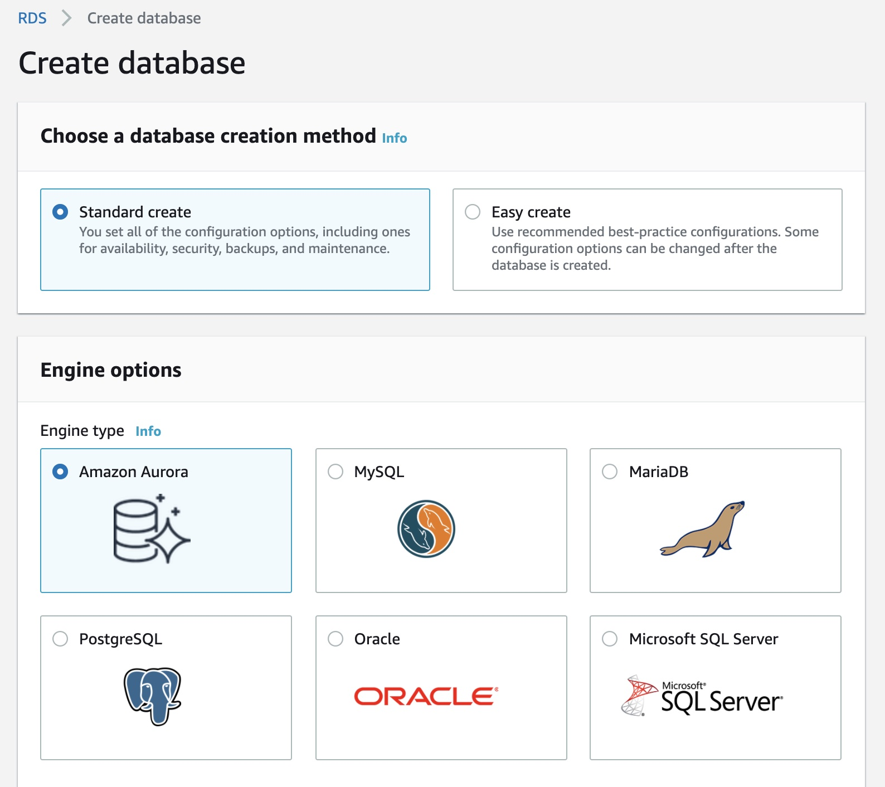
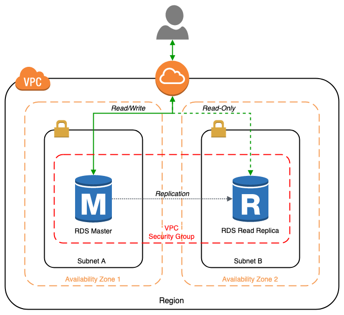
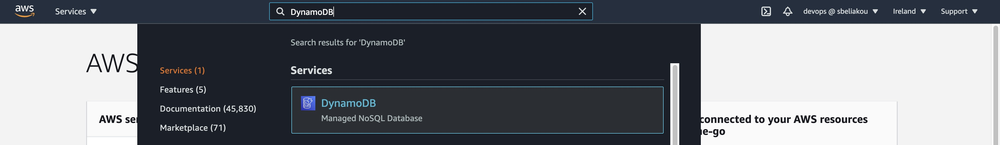
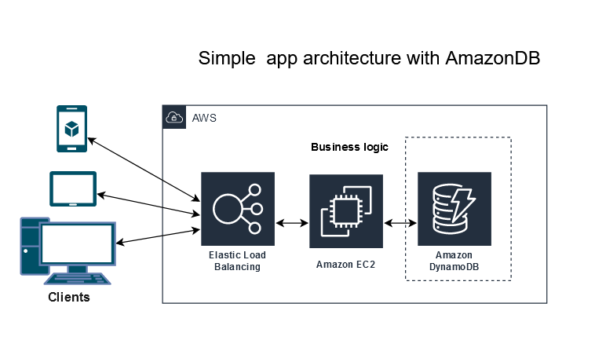
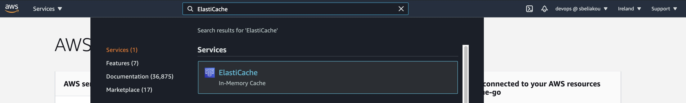
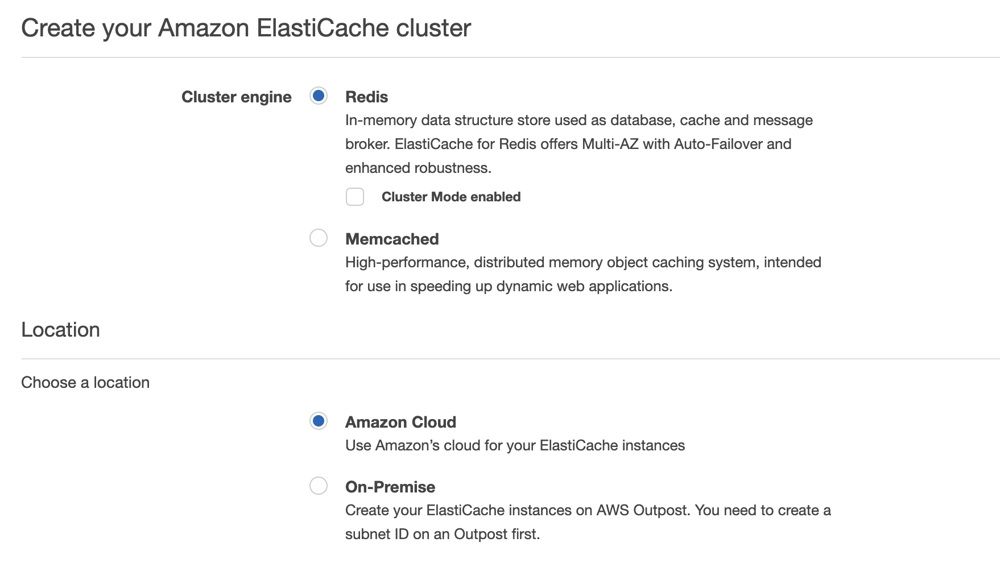

# AWS  Database Services

## Table of Content

- Relational Database Service (RDS)
- DynamoDB 
- ElastiCache
- Move to managed databases

## Recommended Trainings:

- [AWS Certified Solutions Architect - Associate (SAA-C02): 8 Databases](https://learn.epam.com/detailsPage?id=9ba80105-60eb-47b6-96dc-15f4bd6ac5e0&source=EXTERNAL_COURSE)
- [AWS Administration: Tips and Tricks](https://learn.epam.com/detailsPage?id=59938d3d-c5dc-4206-a43f-c90b03babd94&source=EXTERNAL_COURSE)
- [AWS: Storage and Data Management](https://learn.epam.com/detailsPage?id=b08af5ea-1be0-4d45-98d5-90491bbaa32f&source=EXTERNAL_COURSE)

## Database Services on AWS

## Amazon Relational Database Service (Amazon RDS)

Amazon Relational Database Service (Amazon RDS) is a service that makes it easier to set up, operate, and scale a relational databases (SQL) in the AWS Cloud. It provides cost-efficient, resizable capacity for an industry-standard relational database and manages common database administration tasks. 

Amazon RDS takes over many of the difficult and tedious management tasks of a relational database: 

- When you buy a server, you get CPU, memory, storage, and IOPS, all bundled together. With Amazon RDS, these are split apart so that you can scale them independently. If you need more CPU, less IOPS, or more storage, you can easily allocate them. 

- Amazon RDS manages backups, software patching, automatic failure detection, and recovery. 

- To deliver a managed service experience, Amazon RDS doesn't provide shell access to DB instances. It also restricts access to certain system procedures and tables that require advanced privileges. 

- You can have automated backups performed when you need them, or manually create your own backup snapshot. You can use these backups to restore a database. The Amazon RDS restore process works reliably and efficiently. 

- You can use the database products you are already familiar with: MySQL, MariaDB, PostgreSQL, Oracle, Microsoft SQL Server. 

- You can get high availability with a primary instance and a synchronous secondary instance that you can fail over to when problems occur. You can also use MariaDB, Microsoft SQL Server, MySQL, Oracle, and PostgreSQL read replicas to increase read scaling. 

- In addition to the security in your database package, you can help control who can access your RDS databases by using AWS Identity and Access Management (IAM) to define users and permissions. You can also help protect your databases by putting them in a virtual private cloud. 

### Monitoring:

Here a list of events that RDS records. Additionally, here you can get information about what information about an event recorded and the rotation period of records: 
- https://docs.aws.amazon.com/AmazonRDS/latest/UserGuide/USER_ListEvents.html 
- https://docs.aws.amazon.com/AmazonRDS/latest/UserGuide/monitoring-cloudwatch.html 
- https://docs.aws.amazon.com/AmazonRDS/latest/UserGuide/USER_Monitoring.OS.html 

Amazon RDS provides automated recommendations for database resources, such as DB instances, read replicas, and DB parameter groups. These recommendations provide best practice guidance by analyzing DB instance configuration, usage, and performance data:

- https://docs.aws.amazon.com/AmazonRDS/latest/UserGuide/USER_Recommendations.html 

### More details 

Example of CloudWatch alarm for RDS DB instance’s memory consumption:
- https://www.youtube.com/watch?v=TehQPNcudbM 

## Amazon DynamoDB 

**Amazon DynamoDB** is a fully managed **NoSQL** database service that provides fast and predictable performance with seamless scalability.

In DynamoDB, tables, items, and attributes are the core components that you work with. A table is a collection of items, and each item is a collection of attributes.  

DynamoDB supports eventually consistent and strongly consistent reads. 

DynamoDB comes in two Read/Write capacity modes, which should be chosen depending on application load and your budget. 

For working with data, you can access Amazon DynamoDB using the AWS Management Console, the AWS Command Line Interface (AWS CLI), or the DynamoDB API. 

### Use cases / Considerations 

Whenever SQL database (like RDS) is not suitable for your needs (e.g., data structure is not the same across all items), DynamoDB is a great choice for such cases. 

If your application requires really fast reads (real-time bidding, social gaming, and trading applications) DynamoDB Accelerator (DAX) is a good choice, as it will cache query data from DynamoDB and your application will get the needed data much faster. 

As DynamoDB has two Read/Write capacity modes, it’s important to understand, whether to use On-Demand or Provisioned mode. 

### Governance 

DynamoDB provides on-demand backup capability. It allows you to create full backups of your tables for long-term retention and archival for regulatory compliance needs. For more information, see On-Demand Backup and Restore for DynamoDB. 

You can create on-demand backups and enable point-in-time recovery for your Amazon DynamoDB tables. Point-in-time recovery helps protect your tables from accidental write or delete operations. With point-in-time recovery, you can restore a table to any point in time during the last 35 days. For more information, see Point-in-Time Recovery: How It Works. 

DynamoDB allows you to delete expired items from tables automatically to help you reduce storage usage and the cost of storing data that is no longer relevant. For more information, see Expiring Items By Using DynamoDB Time to Live (TTL). 

Dynamo is also integrated with CloudWatch, allowing you to enable logging and monitoring. 

### Cautions 

Dynamo has a number of quotas you need to pay attention to. One of the most important limits is Read/Write throughput. If you exceed this limit, all queries and requests will be throttled. Setting up CloudWatch alerts to track such cases would be really nice. 

### Pricing considerations 

All info regarding DynamoDB pricing can be found in AWS docs 

### More details 

- https://www.youtube.com/watch?v=MF9a1UNOAQo  

## Amazon ElastiCache

**Amazon ElastiCache** makes it easy to set up, manage, and scale distributed **in-memory cache** environments in the AWS Cloud. It provides a high performance, resizable, and cost-effective in-memory cache, while removing complexity associated with deploying and managing a distributed cache environment. ElastiCache works with both the Redis and Memcached engines. 

Supports Memcached and Redis engines:

An ElastiCache cluster is a logical grouping of one or more ElastiCache nodes. Data is partitioned across EC2 machines.

### Governance 

As most of AWS services, ElastiCache is fully integrated with [AWS CloudWatch](https://docs.aws.amazon.com/AmazonElastiCache/latest/mem-ug/CacheMetrics.html) for metrics, [AWS CloudTrail](https://docs.aws.amazon.com/AmazonElastiCache/latest/mem-ug/logging-using-cloudtrail.html) for logging and it also supports [AWS SNS](https://docs.aws.amazon.com/AmazonElastiCache/latest/mem-ug/ECEvents.html), sending all important events to a specific topic. 

For security, ElastiCache provides [several types of encryption](https://docs.aws.amazon.com/AmazonElastiCache/latest/mem-ug/encryption.html) and [Role Based Access Control](https://docs.aws.amazon.com/AmazonElastiCache/latest/mem-ug/Clusters.RBAC.html). 

### Cautions 

Memcached doesn’t have replication like Redis does, so you must make sure it`s handled from application side. 

### Pricing considerations 

All info regarding ElastiCache pricing can be found in [AWS docs](https://aws.amazon.com/elasticache/pricing/)

### More details 

- https://d0.awsstatic.com/whitepapers/performance-at-scale-with-amazon-elasticache.pdf  

## Move to managed databases

- https://aws.amazon.com/getting-started/hands-on/move-to-managed/?trk=gs_card