# AWS Serverless

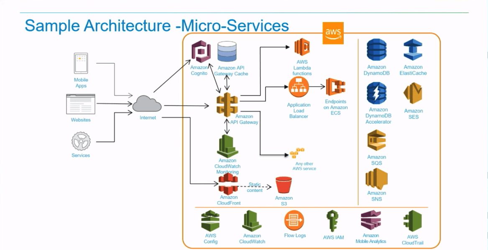

## Table of Content

- API Gateway
- Lambda
- Simple Queue Service (SQS)
- Simple Notification Service (SNS)

## Recommended Trainings:

- [Learning Amazon Web Services Lambda](https://learn.epam.com/detailsPage?id=bca62de9-8c4b-46cd-8ebd-adbb68273fd4&source=EXTERNAL_COURSE)
- [AWS Certified Solutions Architect - Associate (SAA-C02): 7 Application Deployment](https://learn.epam.com/detailsPage?id=62c575ba-7546-4f10-85e9-e9593ec2b31a&source=EXTERNAL_COURSE)

## Amazon API Gateway

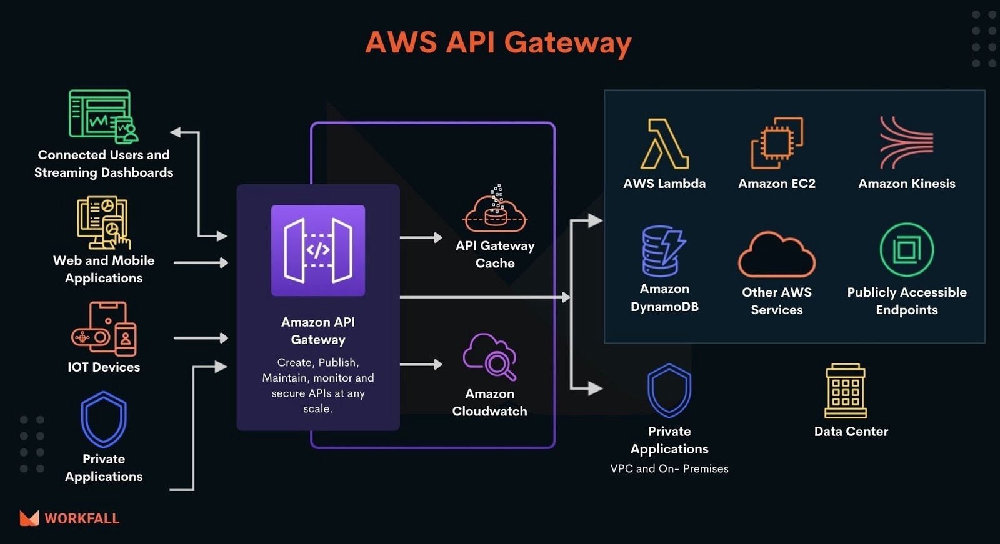

Amazon API Gateway is a fully managed service that makes it easy for developers to create, publish, maintain, monitor, and secure APIs at any scale. APIs act as the "front door" for applications to access data, business logic, or functionality from your backend services. Using API Gateway, you can create RESTful APIs and WebSocket APIs that enable real-time two-way communication applications. API Gateway supports containerized and serverless workloads, as well as web applications. 

API Gateway handles all the tasks involved in accepting and processing up to hundreds of thousands of concurrent API calls, including traffic management, CORS support, authorization and access control, throttling, monitoring, and API version management. API Gateway has no minimum fees or startup costs. You pay for the API calls you receive and the amount of data transferred out and, with the API Gateway tiered pricing model, you can reduce your cost as your API usage scales. 

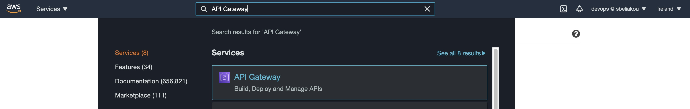

API Gateway creates RESTful APIs that: 

- Are HTTP-based, supports SSL
- Enable stateless client-server communication
- Implement standard HTTP methods such as `GET`, `POST`, `PUT`, `PATCH`, and `DELETE`

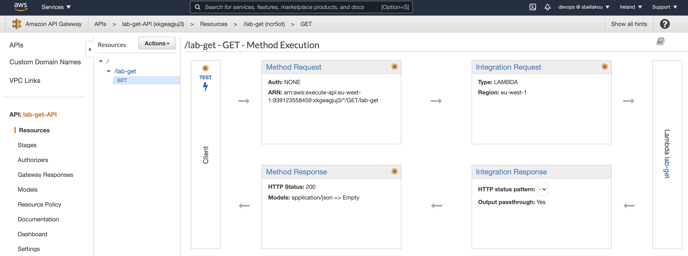

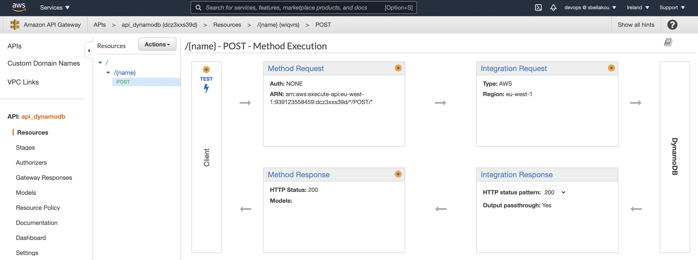

### Use cases:  

There are two kinds of developers who use API Gateway: **API developers** and **App developers**. 

An API developer creates and deploys an API to enable the required functionality in API Gateway. The API developer must be an IAM user in the AWS account that owns the API. 

An app developer builds a functioning application to call AWS services by invoking a WebSocket or REST API created by an API developer in API Gateway. 

The app developer is the customer of the API developer. The app developer doesn't need to have an AWS account, provided that the API either doesn't require IAM permissions or supports authorization of users through third-party federated identity providers supported by Amazon Cognito user pool identity federation. Such identity providers include Amazon, Amazon Cognito user pools, Facebook, and Google. 

With API Gateway, you can launch new services faster and with reduced investment so you can focus on building your core business services. API Gateway was built to help you with several aspects of creating and managing APIs: 

1) **Metering**. API Gateway helps you define plans that meter and restrict third-party developer access to your APIs. You can define a set of plans, configure throttling, and quota limits on a per API key basis. API Gateway automatically meters traffic to your APIs and lets you extract utilization data for each API key. 

2) **Security**. API Gateway provides you with multiple tools to authorize access to your APIs and control service operation access. API Gateway allows you to leverage AWS administration and security tools, such as AWS Identity and Access Management (IAM) and Amazon Cognito, to authorize access to your APIs. API Gateway can verify signed API calls on your behalf using the same methodology AWS uses for its own APIs. Using custom authorizers written as AWS Lambda functions, API Gateway can also help you verify incoming bearer tokens, removing authorization concerns from your backend code. 

3) **Resiliency**. To prevent your APIs from being overwhelmed by too many requests, API Gateway throttles requests to your APIs. Specifically, API Gateway sets a limit on a steady-state rate and a burst of request submissions against all APIs in your account. You can configure custom throttling for your APIs. To learn more, see Throttle API requests for better throughput.

4) **Operations Monitoring**. After an API is published and in use, API Gateway provides you with a metrics dashboard to monitor calls to your services. The API Gateway dashboard, through integration with Amazon CloudWatch, provides you with backend performance metrics covering API calls, latency data and error rates. You can enable detailed metrics for each method in your APIs and also receive error, access or debug logs in CloudWatch Logs. 

5) **Lifecycle Management**. After an API has been published, you often need to build and test new versions that enhance or add new functionality. API Gateway lets you operate multiple API versions and multiple stages for each version simultaneously so that existing applications can continue to call previous versions after new API versions are published. 

6) **Designed for Developers**. API Gateway allows you to quickly create APIs and assign static content for their responses to reduce cross-team development effort and time-to-market for your applications. Teams who depend on your APIs can begin development while you build your backend processes. 

7) **Real-Time Two-Way Communication**. Build real-time two-way communication applications such as chat apps, streaming dashboards, and notifications without having to run or manage any servers. API Gateway maintains a persistent connection between connected users and enables message transfer between them. 

8) **Route53 integration** You can create Route 53 alias record that routes traffic to the regional or Edge-optimized API endpoint.

### Limits:

The following quotas apply per account, per Region in Amazon API Gateway:

| Resource or operation | Default quota | Can be increased |
| --- | --- | --- |
| Throttle quota per account, per Region across HTTP APIs, REST APIs, WebSocket APIs, and WebSocket callback APIs | 10,000 requests per second (RPS) with an additional burst capacity provided by the token bucket algorithm, using a maximum bucket capacity of 5,000 requests.*  **Note**: The burst quota is determined by the API Gateway service team based on the overall RPS quota for the account in the Region. It is not a quota that a customer can control or request changes to. | Yes |
| Regional API | 600 | No |
| Edge-optimized API | 120 | No |

* For the Africa (Cape Town) and Europe (Milan) Regions, the default throttle quota is 2500 RPS and the default burst quota is 1250 RPS. 

All quotas for each type of API Gateways type can be found on [this page](https://docs.aws.amazon.com/apigateway/latest/developerguide/limits.html).

### Pricing

For HTTP APIs and REST APIs, you pay only for the API calls you receive and the amount of data transferred out. There are no data transfer out charges for Private APIs. However, AWS PrivateLink charges apply when using Private APIs in API Gateway. API Gateway also provides optional data caching charged at an hourly rate that varies based on the cache size you select. For WebSocket APIs, you only pay when your APIs are in use based on number of messages sent and received and connection minutes.

The Amazon API Gateway free tier includes one million API calls received for REST APIs, one million API calls received for HTTP APIs, and one million messages and 750,000 connection minutes for WebSocket APIs per month for up to 12 months. If you exceed this number of calls per month, you will be charged the API Gateway usage rates.

- https://aws.amazon.com/api-gateway/pricing/

## AWS Lambda

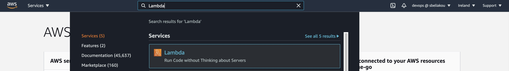

**AWS Lambda** is a serverless compute service that runs your code in response to events and automatically manages the underlying compute resources for you.  

Lambda runs your code on high-availability compute infrastructure and performs all the administration of the compute resources, including server and operating system maintenance, capacity provisioning and automatic scaling, code and security patch deployment, and code monitoring and logging. All you need to do is supply the code. 

The code you run on AWS Lambda is called a “Lambda function.” After you create your Lambda function starts to wait for trigger requests. Each function includes your code as well as some associated configuration information, including the function name and resource requirements. Lambda functions are “stateless,” with no affinity to the underlying infrastructure, so that Lambda can rapidly launch as many copies of the function as needed to scale to the rate of incoming events. 

AWS Lambda could be configured for execution in VPC. However, startup delays would be bigger.

CPU allocation for Lambda could be adjusted by changing the amount of allocated memory to the function. If you increase memory for your function - then you would get better CPU power and vice versa.

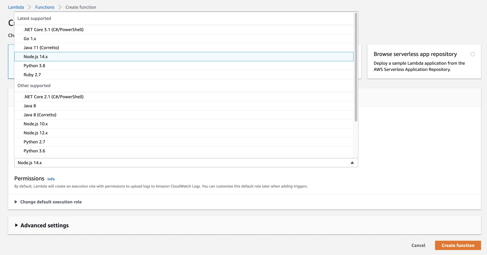
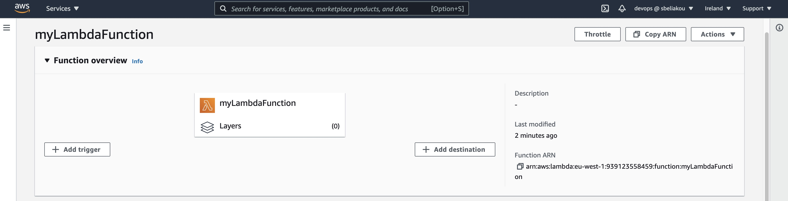
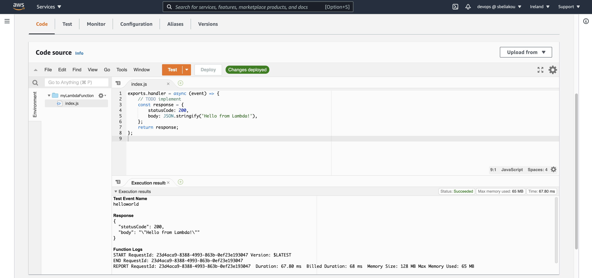

### Use cases: 

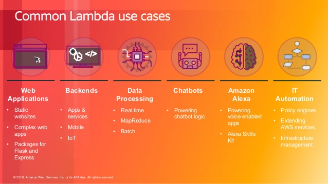

You can use AWS Lambda to extend other AWS services with custom logic, or create your own back-end services that operate at AWS scale, performance, and security. AWS Lambda can automatically run code in response to multiple events, such as HTTP requests via Amazon API Gateway, modifications to objects in Amazon S3 buckets, table updates in Amazon DynamoDB, and state transitions in AWS Step Functions. 

After you upload your code to AWS Lambda, you can associate your function with specific AWS resources (e.g. a particular Amazon S3 bucket, Amazon DynamoDB table, Amazon Kinesis stream, or Amazon SNS notification). Then, when the resource changes, Lambda will execute your function and manage the compute resources as needed in order to keep up with incoming requests. 

#### More Cases Explained:
- https://www.simform.com/serverless-examples-aws-lambda-use-cases/

### Limits: 

Maximum execution time for Lambda is 15 mins. 

AWS Lambda is designed to run many instances of your functions in parallel. However, AWS Lambda has a default safety throttle for number of concurrent executions per account per region (visit here for info on default safety throttle limits). You can also control the maximum concurrent executions for individual AWS Lambda functions which you can use to reserve a subset of your account concurrency limit for critical functions, or cap traffic rates to downstream resources. 
If you wish to submit a request to increase the throttle limit you can visit our Support Center, click "Open a new case," and file a service limit increase request. 

The total unzipped size of the function and all Extensions cannot exceed the unzipped deployment package size limit of 250 MB. It is possible to use Lambda Layers to store runtime dependencies.  

 

If resource or service limits are exceeded, AWS Lambda will try to execute the function three times. 

### Pricing:

Lambda pricing has 2 dimensions: number of requests and total execution time in milliseconds. You are charged based on the number of requests for your functions and the duration, the time it takes for your code to execute. You're not charged when Lambda awaits for trigger request. Duration price depends on the amount of memory you allocate to your function.

The AWS Lambda free usage tier includes 1M free requests per month and 400,000 GB-seconds of compute time per month.

- https://aws.amazon.com/lambda/pricing/ 
- https://calculator.aws/#/createCalculator/Lambda 

## Simple Queue Service (Amazon SQS)

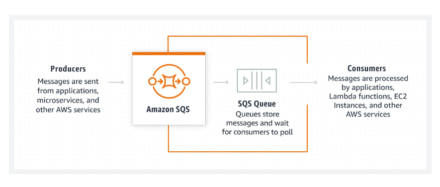

**Amazon Simple Queue Service (Amazon SQS)** is a fully managed message queuing service that enables you to decouple and scale microservices, distributed systems, and serverless applications. SQS eliminates the complexity and overhead associated with managing and operating message oriented middleware, and empowers developers to focus on differentiating work. Using SQS, you can send, store, and receive messages between software components at any volume, without losing messages or requiring other services to be available.  

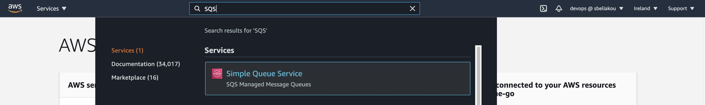

### Use cases / Considerations  

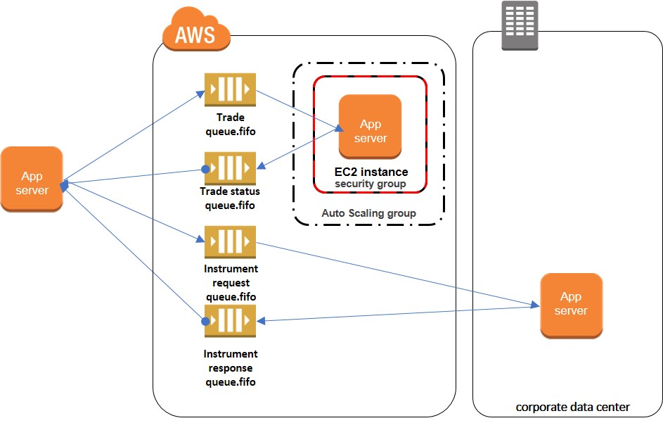

Amazon Simple Queue Service (Amazon SQS) offers a secure, durable, and available hosted queue that lets you integrate and decouple distributed software systems and components. Amazon SQS offers common constructs such as dead-letter queues and cost allocation tags. It provides a generic web services API that you can access using any programming language that the AWS SDK supports.

Amazon SQS supports both standard and FIFO queues:

- Amazon SQS offers standard as the default queue type. Standard queues support a nearly unlimited number of API calls per second, per API action (SendMessage, ReceiveMessage, or DeleteMessage). Standard queues support at-least-once message delivery. However, occasionally (because of the highly distributed architecture that allows nearly unlimited throughput), more than one copy of a message might be delivered out of order. Standard queues provide best-effort ordering which ensures that messages are generally delivered in the same order as they're sent.
- FIFO (First-In-First-Out) queues are designed to enhance messaging between applications when the order of operations and events is critical, or where duplicates can't be tolerated.
- Maximum message size is 256kb

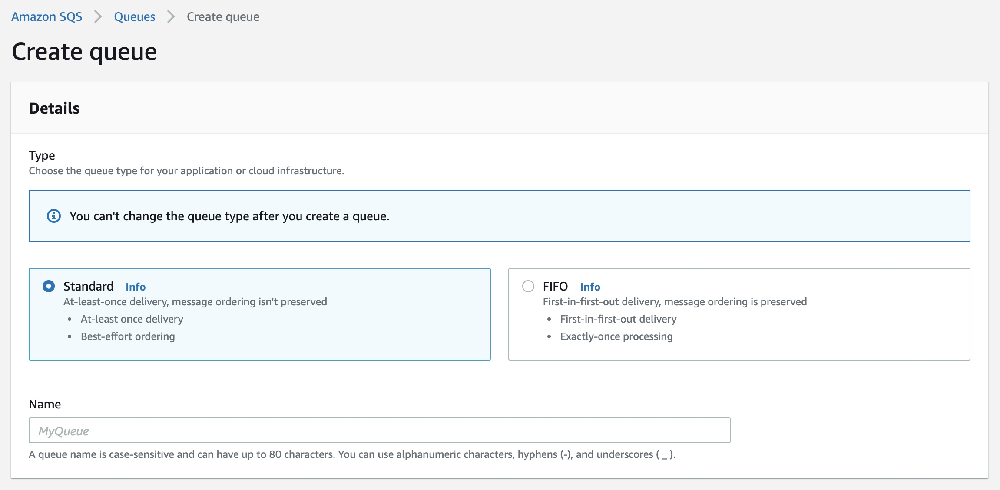

<!-- 
#### More about standart queues. 

You can use standard message queues in many scenarios, as long as your application can process messages that arrive more than once and out of order.  

For example: 

- Decouple live user requests from intensive background work – Let users upload media while resizing or encoding it. 

- Allocate tasks to multiple worker nodes – Process a high number of credit card validation requests. 

- Batch messages for future processing – Schedule multiple entries to be added to a database.[Text Wrapping Break] 

> Note: 
> A standard queue makes a best effort to preserve the order of messages, but more than one copy of a message might be delivered out of order. 

##### At-least-once delivery

Amazon SQS stores copies of your messages on multiple servers for redundancy and high availability. On rare occasions, one of the servers that stores a copy of a message might be unavailable when you receive or delete a message. 

If this occurs, the copy of the message isn't deleted on that unavailable server, and you might get that message copy again when you receive messages. Design your applications to be idempotent (they should not be affected adversely when processing the same message more than once). 

#### More about FIFO queues. 

Where is FIFO the best choose: 

- To make sure that user-entered commands are run in the right order. 
- To display the correct product price by sending price modifications in the right order. 
- To prevent a student from enrolling in a course before registering for an account.[Text Wrapping Break] 

FIFO queues also provide exactly-once processing but have a limited number of transactions per second (TPS). 

> Note: 
> The name of a FIFO queue must end with the .fifo suffix. The suffix counts towards the 80-character queue name quota. To determine whether a queue is FIFO, you can check whether the queue name ends with the suffix. 

FIFO message ordering. 

The FIFO queue improves upon and complements the standard queue. The most important features of this queue type are FIFO (First-In-First-Out) delivery and exactly-once processing: 

The order in which messages are sent and received is strictly preserved and a message is delivered once and remains available until a consumer processes and deletes it.[Text Wrapping Break] 

Duplicates aren't introduced into the queue.[Text Wrapping Break] 

In addition, FIFO queues support message groups that allow multiple ordered message groups within a single queue. There is no quota to the number of message groups within a FIFO queue. 

Amazon SQS dead-letter queues 

Amazon SQS supports dead-letter queues, which other queues (source queues) can target for messages that can't be processed (consumed) successfully. Dead-letter queues are useful for debugging your application or messaging system because they let you isolate problematic messages to determine why their processing doesn't succeed. 

 

Important: 

The dead-letter queue of a FIFO queue must also be a FIFO queue. Similarly, the dead-letter queue of a standard queue must also be a standard queue. 

 

Benefits of dead-letter queues. 

Configure an alarm for any messages delivered to a dead-letter queue. 

Examine logs for exceptions that might have caused messages to be delivered to a dead-letter queue. 

Analyze the contents of messages delivered to a dead-letter queue to diagnose software or the producer’s or consumer’s hardware issues. 

Determine whether you have given your consumer sufficient time to process messages

-->

### Pricing
AWS SQS is priced by amount of messages per month. 

Amazon SQS Free Tier includes 1 million Amazon SQS requests for free each month. Some applications might be able to operate within this Free Tier limit. 

### Useful Links: 

- [What is Amazon Simple Queue Service](https://docs.aws.amazon.com/AWSSimpleQueueService/latest/SQSDeveloperGuide/welcome.html)
- [Introducing Amazon Simple Queue Service (SQS) FIFO Queues – Messaging on AWS](https://www.youtube.com/watch?v=XrX7rb6M3jw&ab_channel=AmazonWebServices )
- [Amazon SQS dead-letter queues](https://docs.aws.amazon.com/AWSSimpleQueueService/latest/SQSDeveloperGuide/sqs-dead-letter-queues.html )

## Simple Notification Service (Amazon SNS)

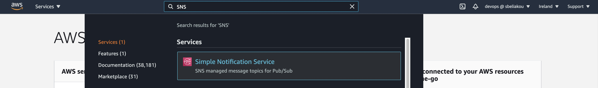

Amazon Simple Notification Service (Amazon SNS) is a fully managed messaging service for both application-to-application (A2A) and application-to-person (A2P) communication. 

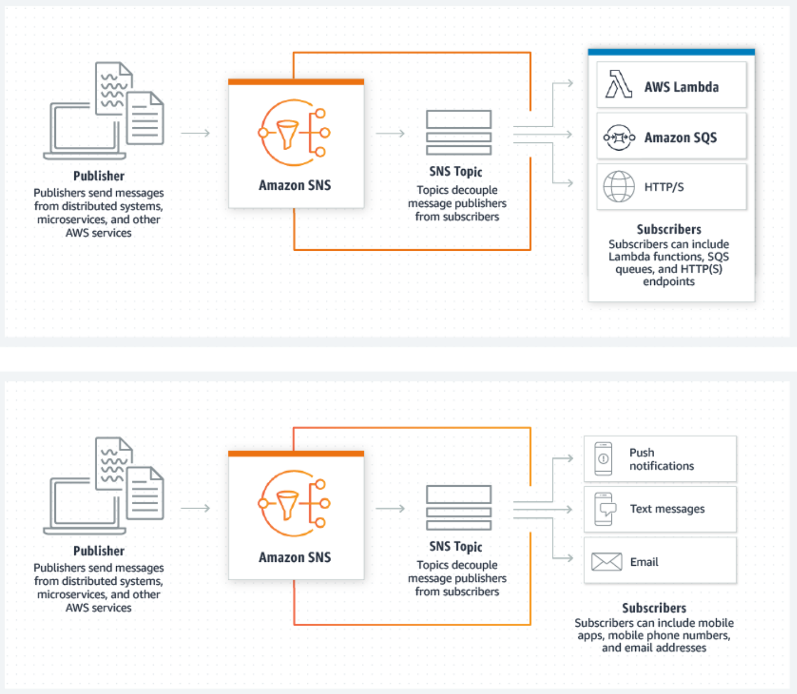

SNS provides message delivery from publishers to subscribers (also known as producers and consumers). Publishers communicate asynchronously with subscribers by sending messages to a topic, which is a logical access point and communication channel. Clients can subscribe to the SNS topic and receive published messages using a supported endpoint type, such as Amazon Kinesis Data Firehose, Amazon SQS, AWS Lambda, HTTP, email, mobile push notifications, and mobile text messages (SMS). 

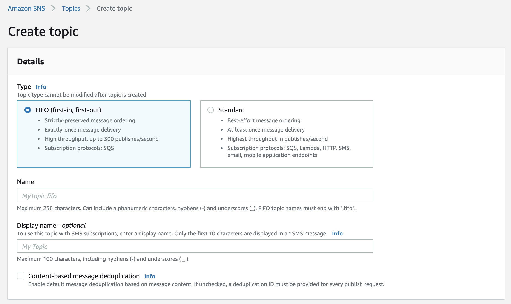

Amazon SNS provides the following features and capabilities: 
- Application-to-application messaging 
- Application-to-person notifications 
- Standard and FIFO topics 
- Message durability 
- Message archiving and analytics 
- Message attributes 
- Message filtering 

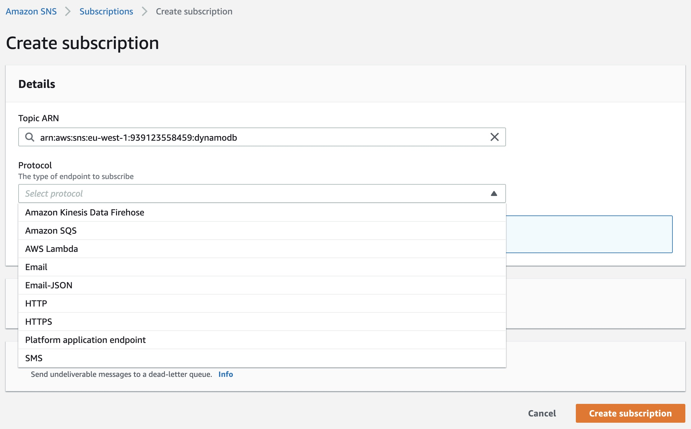

Next AWS services has integration with Amazon SNS out of the box: 
- Amazon SQS
- AWS Lambda 
- AWS Identity and Access Management (IAM) 
- AWS CloudFormation[Text Wrapping Break] 

### Pricing for Amazon SNS 

Amazon SNS has no upfront costs. You pay based on the number of messages that you publish, the number of notifications that you deliver, and any additional API calls for managing topics and subscriptions. Delivery pricing varies by endpoint type. You can get started for free with the Amazon SNS free tier. 

### Useful Links: 

- [Amazon SNS](https://docs.aws.amazon.com/sns/latest/dg/welcome.html)
- [Event-Driven Pub-Sub with SNS and SQS](https://www.youtube.com/watch?v=c_WNBmEc6EE&ab_channel=AmazonWebServices) 