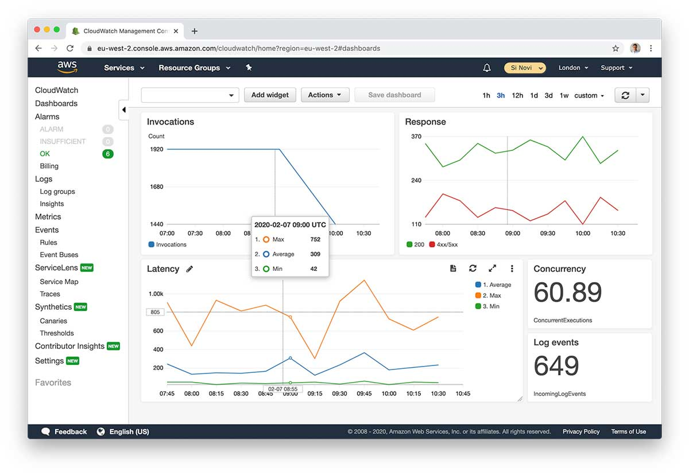
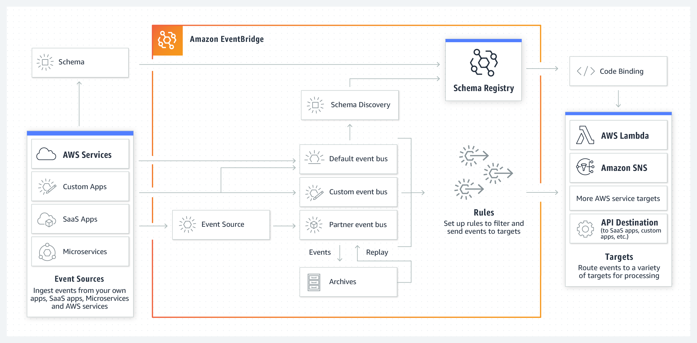
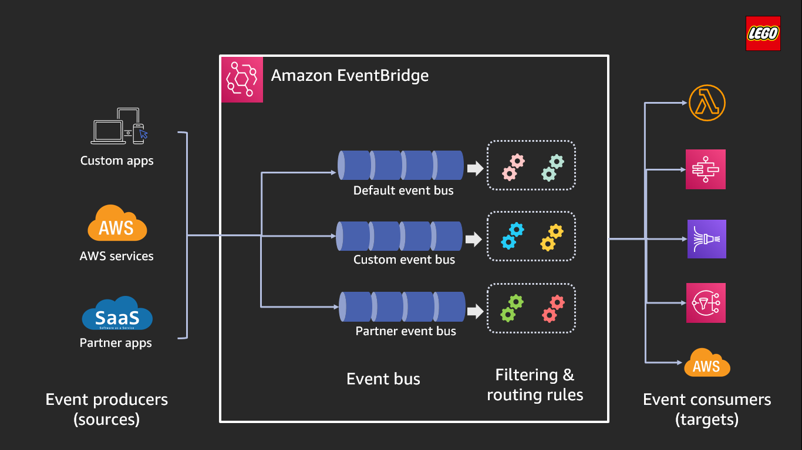
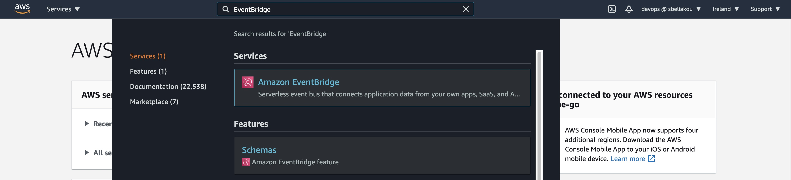
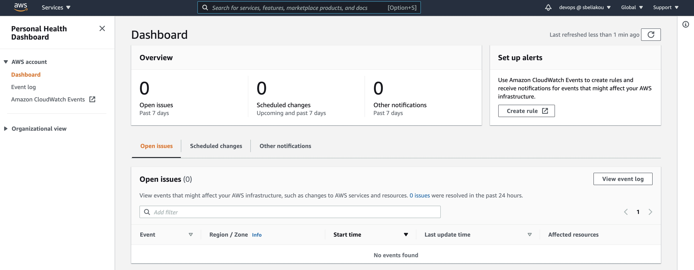

# Observability Services

## Table of Content:

- CloudWatch
- Enhanced Monitoring with CloudWatch (EC2 and RDS)
- EventBridge
- AWS Health

## CloudWatch 

Amazon CloudWatch monitors your Amazon Web Services (AWS) resources and the applications you run on AWS in real time. With CloudWatch, you gain system-wide visibility into resource utilization, application performance, and operational health.  

### Use cases

You can set up custom dashboards, that allow you to monitor custom metrics in a useful format. Another benefit is that you can compare some important metrics in one dashboard, which will save your time when you want to get information about your infrastructure. https://docs.aws.amazon.com/AmazonCloudWatch/latest/monitoring/create_dashboard.html 

You can gather metrics metrics from multiple regions https://docs.aws.amazon.com/AmazonCloudWatch/latest/monitoring/Cross-Account-Cross-Region.html#enable-cross-account-cross-Region 

 
### Cautions 

There are a lot of limitations in the CloudWatch service, but these are the most important: 

- Alarm actions ( 5 per alarm ) 
- Alarms ( 10/month/customer for free. 5000 per Region, per account ) 
- API requests ( 1,000,000/month/customer for free ) 
- Dashboards ( Up to 500 metrics per dashboard widget. Up to 2500 metrics per dashboard, across all widgets ) 
- Metric data storage ( 15 months ) 
- Period ( Maximum value is one day ) 
- Amazon SNS email notifications ( 1,000/month/customer for free ) 

More detailed information about limitations you can get [here](https://docs.aws.amazon.com/AmazonCloudWatch/latest/monitoring/cloudwatch_limits.html)

### Pricing considerations 

When you sign up for AWS, you can get started with CloudWatch Logs for free using the AWS Free Tier.  

Standard rates apply for logs stored by other services using CloudWatch Logs (for example, Amazon VPCflow logs and Lambda logs).   

For more information, see [Amazon CloudWatch Pricing](https://aws.amazon.com/cloudwatch/pricing/)

### More details:

- Link to the video with [creating custom dashboard](https://youtu.be/I7EFLChc07M?t=198)

## Enhanced Monitoring with CloudWatch (EC2 and RDS)

- https://www.site24x7.com/blog/amazon-ec2-monitoring-combine-cloudwatch-system-metrics
- https://docs.aws.amazon.com/AmazonRDS/latest/UserGuide/USER_Monitoring.OS.overview.html

## Amazon EventBridge

Amazon EventBridge is a serverless event bus service that makes it easy to connect your applications with data from a variety of sources. EventBridge delivers a stream of real-time data from your own applications, Software-as-a-Service (SaaS) applications, and AWS services and routes that data to targets such as AWS services like AWS Lambda or Kinesis, to an HTTP invocation endpoint using an API destination, or to the event bus in another account. To define how events are processed, you set up rules in EventBridge to define a filter pattern to match incoming events. When EventBridge receives an event with an event pattern that matches the event pattern you defined in a rule, the event is sent to the target or targets you define for the rule. 
 

EventBridge was formerly called Amazon CloudWatch Events. The default event bus and any rules you created in CloudWatch Events are also displayed in the EventBridge console. EventBridge uses the same CloudWatch Events API, so all of your existing CloudWatch Events API usage remains the same. New features added to EventBridge are not added to CloudWatch Events. 

### Use cases

Amazon EventBridge provides several features: 

1. **API Destinations**

    API Destinations is a new feature for EventBridge that enables developers to send events back to many on-prem or SaaS applications with the ability to control throughput and authentication. Customers can send events to any web-based application with a web address without worrying about writing custom code, or using additional infrastructure. 

2. **Archive and Replay Events(Allows to reprocess events)**
3. **Schema Registry**
4. **Over 100 built-in event sources and targets** (AWS Lambda, Amazon SQS, Amazon SNS, AWS Step Functions, Amazon Kinesis Data Streams, Amazon Kinesis Data Firehose, and more)
5. **Event filtering**
6. **Decoupled event publishers and subscribers**
7. **Reliable event delivery**
8. **Automatic response to operational changes in AWS Services**
9. **Scheduled events**
10. **Monitoring and auditing events**

### Governance 
EventBridge sends metrics to Amazon CloudWatch every minute. 
The AWS/Events namespace includes the following metrics: 
- `DeadLetterInvocations` 
- `FailedInvocations` 
- `Invocations` 
- `InvocationsFailedToBeSentToDlq` 
- `InvocationsSentToDlq` 
- `ThrottledRules` 
- `TriggeredRules` 
- `MatchedEvents` 
 
https://docs.aws.amazon.com/eventbridge/latest/userguide/eb-monitoring.html 
 
### Cautions 

Amazon EventBridge has the following limitations: 

- Event Publishing API requests:  depends on a region(2500 r/s – 10000 r/s) 
- Event buses: up to 100 per account 
- Invocations: depends on a region 
- Connections: 3.000 
- API destinations: 3.000 
- Rules: 300 per event bus 
- Targets: up to 5 targets per rule 

 
### Pricing considerations 
All prices are provided for US East 1(Ohio) region. 

Event Buses: 
- AWS service events: Free 
- Custom events: $1.00/million custom events published 
- Third-party (SaaS) events: $1.00/million events published 
- Cross-account events: $1.00/million cross-account events sent 

API Destinations: 
- Invocations: $0.20 per million 

Event Replay: 
Customers will be able to specify event patterns to determine which events they want to archive for replay. Customers are charged at: 
- Archive Processing: $0.10 per GB 
- Storage / Month: $0.023 per GB 

### More details 

- [EventBridge pricing](https://aws.amazon.com/eventbridge/pricing/)
- [Monitoring EventBridge](https://docs.aws.amazon.com/eventbridge/latest/userguide/eb-monitoring.html)
- [Getting started with EventBridge](https://docs.aws.amazon.com/eventbridge/latest/userguide/eb-get-started.html)
- [Events sources](https://docs.aws.amazon.com/eventbridge/latest/userguide/eb-service-event.html)
- [EventBridge tutorials](https://docs.aws.amazon.com/eventbridge/latest/userguide/eb-tutorial.html)

## AWS Health

AWS Health provides personalized information about events that can affect your AWS infrastructure, guides you through scheduled changes, and accelerates the troubleshooting of issues that affect your AWS resources and accounts.

### Considerations

- General overview: https://docs.aws.amazon.com/health/latest/ug/what-is-aws-health.html
- Personal Health Dashboard( PHD )https://docs.aws.amazon.com/health/latest/ug/getting-started-phd.html
- You can use the AWS Personal Health Dashboard to view events and affected entities and perform advanced filtering. That dashboard shows recent and upcoming events organized by category, and a full event log that shows all events from the past 90 days

### Governance:
Not required

### Pricing considerations

All customers can use PHD without pay, but customers who have a Business or Enterprise support plan can use the AWS Health API to integrate with in-house and third-party systems

https://aws.amazon.com/premiumsupport/pricing/?nc2=type_a

### AWS Workshop:

- https://intelligent-cloud-operations.workshop.aws/lab01.html